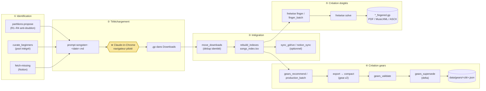

# FretWise — Workflow complet de création d'une chanson

De l'**identification** d'un morceau à ses **doigtés optimisés**, en passant par
le **téléchargement**, l'**intégration au dépôt** et la **création de la fiche
gear**. Ce document est le mode d'emploi opérationnel ; pour l'architecture voir
[architecture.md](architecture.md), pour l'inventaire des CLI voir
[../scripts/README.md](../scripts/README.md).

> **Convention de commandes.** Tout s'exécute depuis la racine du dépôt dans
> l'environnement pixi. Les entrées « ★ agent » ou « ★ navigateur » signalent les
> deux seules étapes non autonomes (découverte web et téléchargement Songsterr) —
> tout le reste est du code déterministe.

## Vue d'ensemble



Les étapes ① à ③ sont **séquentielles**. Les étapes ④ et ⑤ sont
**indépendantes** l'une de l'autre : une fiche gear ne dépend pas des doigtés,
et inversement — elles peuvent être menées en parallèle une fois le `.gp`
intégré (③). Le nœud jaune (★) est le seul maillon non déterministe du
pipeline : un navigateur piloté par agent, pas du code.

*(Rendu natif sur GitHub/GitLab/VS Code/Cursor. Source éditable en ligne :
[mermaid.live](https://mermaid.live) — coller le bloc ci-dessus.)*

---

## Étape 1 — Identification des morceaux

Objectif : produire une liste de candidats **absents** de la bibliothèque, puis le
prompt Songsterr du jour. Quatre points d'entrée selon le besoin.

### 1a. Proposition équilibrée (voie principale)

```powershell
pixi run partitions-propose
# = python scripts/partitions_propose.py [--count 100] [--candidates fichier.txt]
```

Règles anti-doublon appliquées dans l'ordre :
- **R1** — `songs_index.tsv` est la source de vérité (la bibliothèque locale) ;
- **R2** — tout candidat déjà présent dans le TSV est écarté ;
- **R3** — équilibrage par artiste/genre (les artistes surreprésentés sont bridés) ;
- **R4** — écriture de `extract-<date>.txt` (brut) puis `extract-<date>_checked.txt`
  (filtré, **seule** source du prompt) puis `prompt-songsterr-<date>.md`.

**Alimentation des candidats.** Si aucun `--candidates` n'est fourni, le script
crée `candidates_seed.txt` vide et s'arrête sur `[wait] … compléter via web_search`.
C'est ici qu'intervient **★ l'agent** : il remplit le fichier (une ligne
`Artiste - Titre (Année)`) par recherche web, puis on relance la commande.

### 1b. Pool débutants intégré (sans agent)

```powershell
pixi run python scripts/partitions_curate_beginners.py
```

~370 morceaux « faciles » codés en dur (accords ouverts, tempo modéré, connus),
filtrés contre la collection. Produit directement `prompt-songsterr-<date>.md`
avec les URLs de recherche Songsterr. Aucune découverte web nécessaire.

### 1c. Combler les manques déclarés dans Notion

```powershell
pixi run python scripts/partitions_sync_songs.py fetch-missing chemin/notion_songs.json
```

Liste les URLs de recherche Songsterr pour les morceaux présents dans la base
Notion « Songs Library » mais absents en local (`.gp` manquant).

### 1d. Vérification manuelle d'une liste externe

```powershell
pixi run python scripts/partitions_check.py candidats.txt
# écrit candidats_checked.txt (doublons du TSV retirés, plafond par artiste)
```

À faire **impérativement** avant tout téléchargement si la liste ne vient pas de
`propose_songs` (garantit R2).

**Sortie de l'étape 1 :** `prompt-songsterr-<date>.md` à la racine partitions,
listant N morceaux à récupérer + leurs URLs Songsterr.

---

## Étape 2 — Téléchargement depuis Songsterr

> **Songsterr n'a pas d'API de téléchargement.** L'obtention du `.gp` passe
> obligatoirement par le navigateur piloté. Le code ne fait que **générer le
> prompt** ; il ne télécharge pas lui-même.

### 2a. (Re)générer le prompt exécutable

```powershell
pixi run python scripts/partitions_songsterr_prompt.py
```

Reconstruit `prompt-songsterr-<date>.md` avec la procédure `javascript_tool`
éprouvée (zéro capture d'écran), fondée sur des **IDs DOM stables** :

| Élément | Sélecteur |
|---|---|
| Premier résultat de recherche | `main a[href^="/a/wsa/"]:not([href*="/r"])` |
| Bouton export | `button#control-export` |
| Boîte de dialogue de format | `form#export_modal` |
| Bouton Guitar Pro | `button#control-export-gp` (jamais `#control-export-midi`) |

### 2b. Exécuter le prompt — ★ navigateur

Donner le contenu de `prompt-songsterr-<date>.md` à **Claude-in-Chrome**
(compte **Songsterr Plus** requis pour l'export GP). L'agent enchaîne, par
morceau : recherche → clic export → choix Guitar Pro → téléchargement. Les
fichiers `.gp` atterrissent dans `FRETWISE_DOWNLOADS_DIR` (défaut `~/Downloads`).

**Sortie de l'étape 2 :** un ou plusieurs `.gp` bruts dans Downloads.

---

## Étape 3 — Intégration au dépôt

Objectif : ranger les `.gp`, dédupliquer, réindexer, propager.

### 3a. Ingestion depuis Downloads

```powershell
pixi run partitions-move
# = python scripts/partitions_move_downloads.py [--downloads DIR] [--dry-run]
```

Déplace les `.gp` de Downloads vers `<root>/partitions/`, **déduplique par
identité normalisée** (`lib.normalize_identity` : décodage des `_`, artistes
composés) — en cas de doublon, conserve le plus gros fichier et archive le perdant
dans `<root>/_doublons_archive/`.

### 3b. Réindexation

```powershell
pixi run partitions-rebuild
# = python scripts/partitions_rebuild.py
```

Régénère `songs_index.tsv` (10 colonnes) et `liste_partitions.txt`. **Préserve**
les colonnes possédées par Notion (`year`, `genre`, `guitar`, `rig`, `notion_id`).
La colonne `fingered` vaut `1` si le nom de fichier porte le suffixe `_fingered`
(alimentée à l'étape 5).

### 3c. Métadonnées & propagation (optionnel)

```powershell
pixi run python scripts/partitions_tag_genres.py --dry-run   # auto-tag genre/guitare
pixi run python scripts/partitions_enrich_notion.py          # file _notion_queue/ pour l'agent
pixi run python scripts/partitions_notion_sync.py --dry-run  # sync directe (NOTION_TOKEN)
pixi run python scripts/partitions_sync_gdrive.py --dry-run  # miroir Google Drive
pixi run python scripts/partitions_archive_old.py            # rotation des artefacts datés
```

### 3d. Tout enchaîner d'un coup

```powershell
pixi run partitions-daily
# orchestre, dans l'ordre et avec log dans _archive_logs/<date>/ :
#   move_downloads → rebuild_indexes → enrich_from_notion → propose_songs → archive_old
```

`partitions_daily_sync.py` appelle directement les `main()` des modules (pas de
subprocess) ; `--skip <étape>` permet d'en sauter une.

**Sortie de l'étape 3 :** `.gp` rangés dans `<root>/partitions/`, `songs_index.tsv`
à jour, éventuellement miroir GDrive + enregistrements Notion.

---

## Étape 4 — Création de la fiche gear (« son »)

Objectif : produire `data/gears/<artiste>__<titre>.json` (schéma
`songsgear.fretwise.gear.v2`), servie par l'interface web sur `/api/rig/`.
La clé canonique vient de `fretwise.gears.naming.gears_key` (partagée avec les
partitions, tolérante aux deux styles de nommage historiques).

### 4a. Une seule chanson (rapide)

```powershell
# Sans réseau (structure de test) :
pixi run python scripts/gears_recommend.py --config CONFIG.json `
    --artist "Dire Straits" --title "Sultans of Swing" --provider mock

# Voir/enregistrer le prompt LLM seul (pour un LLM externe) :
pixi run python scripts/gears_prompt.py --config CONFIG.json --artist ... --song ...
```

Providers disponibles : `mock` (hors-ligne), `ollama` (local), `openai`, `claude`.

### 4b. Production en lot (voie recommandée pour du volume)

```powershell
pixi run python scripts/gears_production_batch.py --input songs.tsv --resume
```

Pipeline économique par morceau : **draft Ollama** → **juge OpenAI**
(`gpt-5.4-mini`) → **escalade Claude** si nécessaire → classification de genre →
validation. Reprise sur interruption via `checkpoint.json` (`--resume` lit
`nextOffset`) ; `--offset`/`--limit` pour borner ; sorties verboses dans
`--output-root` (défaut sous `exports/`). Clés API lues via `.env`
(`fretwise.gears.production.env`).

### 4c. Post-traitement → schéma v2 déployable

```powershell
# Extraire le bloc rig.v1 des sorties verboses :
pixi run python scripts/gears_export.py --in "exports/.../Songs/*.json"
# Normaliser :
pixi run python scripts/gears_normalize.py
# Compacter en gear.v2 vers data/gears/ :
pixi run gears-compact          # --input-dir / --output-dir / FRETWISE_GEARS_DIR
# Valider les fiches :
pixi run gears-validate
```

### 4d. Faire de la fiche la source unique (gestion du delta)

```powershell
pixi run gears-supersede        # = python scripts/gears_supersede.py [--dry-run]
```

Pour chaque `data/gears/<clé>.json`, supprime l'entrée legacy correspondante dans
`data/curated_facts*.json` et la fiche générée `partitions/rigs/<fichier>.md`, de
sorte que le JSON devienne l'unique source. **Idempotent** : réexécuter est sans
effet. C'est le mécanisme de « delta » — une nouvelle fiche remplace
automatiquement l'ancienne représentation, au runtime (priorité API) comme au
nettoyage.

**Sortie de l'étape 4 :** `data/gears/<clé>.json` (gear.v2) validée, visible dans
l'interface web sous l'onglet rig de la chanson.

---

## Étape 5 — Création des doigtés

Objectif : calculer les doigtés main gauche optimaux et produire les rendus.
Indépendant de l'étape 4.

### 5a. Un morceau — calcul et export

```powershell
# Doigtés → PDF (+ ASCII), format déduit de l'extension :
pixi run fretwise solve "<root>/partitions/Artiste - Titre.gp" -o sortie.pdf

# Modes de pondération (fonction de coût) :
pixi run fretwise solve song.gp --mode performance   # concert
pixi run fretwise solve song.gp --mode musical       # interprétation
pixi run fretwise solve song.gp --mode learning      # travail technique
pixi run fretwise solve song.gp --mode reference     # benchmark (défaut)
```

Formats de sortie (`-o` / `--format`) : PDF (tablature gravée), MusicXML,
ASCII tab, JSON, txt (rapport par note). Sans `-o`, le JSON part sur stdout.

Les modèles ML (`data/models/*.onnx`, si `onnxruntime` présent) affinent le choix
du **doigt** automatiquement ; en leur absence, repli silencieux sur les règles
biomécaniques.

### 5b. Un morceau — annoter le `.gp` en place

```powershell
pixi run fretwise finger "Artiste - Titre.gp" --mode learning
# écrit "Artiste - Titre_fingered.gp" (annotation LeftFingering)
```

Le suffixe `_fingered` est reconnu par `rebuild_indexes` (colonne `fingered=1`).

### 5c. Tout le corpus — batch reprenable

```powershell
pixi run python tools/finger_batch.py            # traite tous les .gp « périmés », reprend
pixi run python tools/finger_batch.py --limit 20 # les 20 premiers en attente
```

Multi-cœurs, checkpoint après chaque fichier dans
`exports/finger_batch_state.json` ; saute les fichiers dont les doigtés sont déjà
à jour (`FINGERING_ALGO_VERSION` + méta sidecar). Ignore les `*_fingered.gp`
(sources uniquement). Produit les `*_fingered.gp` et les sidecars
`*_fingering*.json` à côté des sources.

### 5d. Conversion / réannotation

```powershell
pixi run fretwise convert in.gp out.musicxml            # GP/MIDI → MusicXML (doigtés préservés)
pixi run fretwise convert in.gp out.gp --mode learning  # réannoter un .gp
```

**Sortie de l'étape 5 :** `*_fingered.gp` + sidecars dans `<root>/partitions/`,
rendus PDF/MusicXML/ASCII à l'emplacement demandé, `fingered=1` au prochain rebuild.

---

## Récapitulatif — enchaînement minimal d'une nouvelle chanson

```powershell
# 1. Identifier (remplir candidates_seed.txt via l'agent si demandé)
pixi run partitions-propose

# 2. Générer le prompt, puis ★ Claude-in-Chrome télécharge le .gp dans Downloads
pixi run python scripts/partitions_songsterr_prompt.py

# 3. Intégrer
pixi run partitions-move
pixi run partitions-rebuild

# 4. Fiche gear
pixi run python scripts/gears_recommend.py --config CONFIG.json --artist "…" --title "…" --provider ollama
pixi run gears-compact
pixi run gears-validate
pixi run gears-supersede

# 5. Doigtés
pixi run fretwise finger "<root>/partitions/… .gp" --mode learning
pixi run fretwise solve   "<root>/partitions/… .gp" -o sortie.pdf
```

## Points d'attention

- **Deux maillons non autonomes** : la découverte de candidats (★ agent, remplit
  `candidates_seed.txt`) et le téléchargement Songsterr (★ Claude-in-Chrome). Tout
  le reste est déterministe et scriptable.
- **Source de vérité** : `songs_index.tsv` pour la bibliothèque, `data/gears/*.json`
  pour les sons. Ne jamais interroger Notion pour une info présente dans le TSV.
- **Variables d'environnement** : `FRETWISE_PARTITIONS_ROOT`,
  `FRETWISE_DOWNLOADS_DIR`, `FRETWISE_GDRIVE_DIR`, `FRETWISE_GEARS_DIR`,
  `NOTION_TOKEN`, clés LLM via `.env` (tableau complet dans [usage.md](usage.md) §1).
- **Idempotence** : `move_downloads`, `rebuild_indexes`, `gears_supersede` et
  `finger_batch` sont sûrs à relancer.
