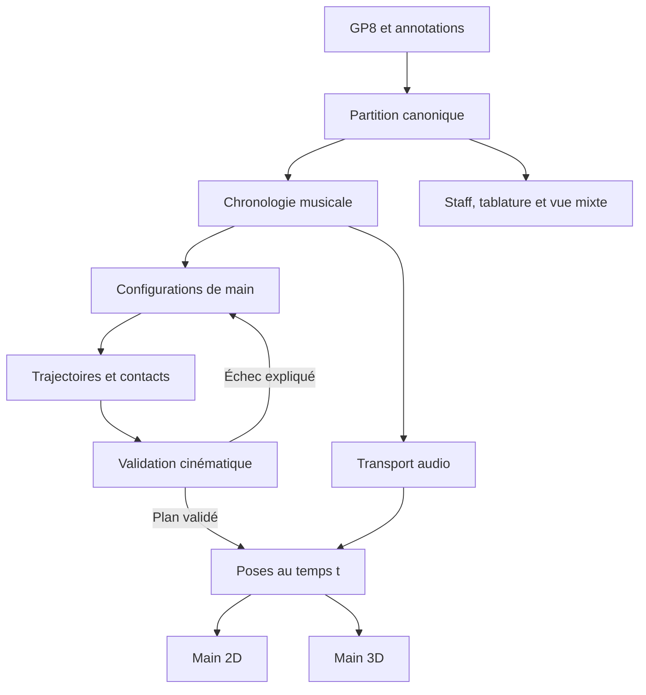

Here is the result of "fetch" for the Page with URL https://app.notion.com/p/3dad399a325b81a0be7ac362bcd341a6 as of 2026-09-14T11:23:15.278Z:
<page url="https://app.notion.com/p/3dad399a325b81a0be7ac362bcd341a6" icon="🎸">
<ancestor-path>
<parent-data-source url="collection://2c4d399a-325b-80ab-bd46-000b29744593" name="Base de connaissances"/>
<ancestor-2-database url="https://app.notion.com/p/2c4d399a325b80c7b9eee9cc3ef75da5" title=""/>
<ancestor-3-page url="https://app.notion.com/p/4a13d89c2de84da29c016b6ba3f5d73a" title="Base de connaissances – Ressources"/>
</ancestor-path>
<properties>
{"Catégorie":"Informatique","Liens vers projets":"","Notes additionnelles":"Étude de conception fondée sur la lecture du commit 64470eb de master. Validation pratique à réaliser ; aucun code modifié.","Page parente":"","Sous-catégorie":["Guitare","Programmation"],"Statut PARA":"Projet","Statut de page":"Complète","Titre":"FretWise — Étude des doigtés et de l’animation 2D/3D","Type de contenu":["Texte","Tableau","Liens"],"date:Date d'ajout:is_datetime":0,"date:Date d'ajout:start":"2026-09-13","url":"https://app.notion.com/p/3dad399a325b81a0be7ac362bcd341a6","userDefined:URL":"https://github.com/targuy/fretwise"}
</properties>
<iconMetadata>{"type":"emoji","emoji":"🎸"}</iconMetadata>
<content>
Étude de conception • 13 septembre 2026 • Benoît Guitard • Version 1.0
**Objet :** rendre les doigtés jouables et idiomatiques, puis représenter une main crédible, précise et synchronisée dans les vues 2D et 3D de FretWise.
**Base examinée :** dépôt [targuy/fretwise](https://github.com/targuy/fretwise), branche master, commit **64470ebd10cf19a0ff3a53ce087a6914bd7aefe3**. La branche main consultée contient essentiellement README et Claude_Design ; elle ne représente pas le code applicatif analysé.
**Nature des résultats :** lecture statique ciblée du code et des spécifications, complétée par des sources primaires. Application, fichiers GP personnels, modèles ONNX et modèles GLB non exécutés ni inspectés visuellement. Aucun résultat de performance ou d’évaluation humaine n’est présenté comme mesuré. Les critères chiffrés ci-dessous sont des objectifs proposés.
## Décision recommandée
Construire une chaîne explicite **partition → état musical → contacts de la main → trajectoires → poses → rendu**, avec un contrôle de faisabilité entre le calcul des doigtés et l’animation.
Conserver Python, FastAPI, le moteur de notation existant, Three.js et l’interface publique de Viterbi. Concentrer l’effort sur le modèle de la main, le temps partagé, la génération des candidats et la validation. L’apprentissage automatique doit classer des solutions physiquement admissibles.
**La “perfection” doit être définie par un contrat vérifiable.** Une partition ne détermine pas une unique interprétation gestuelle, et plusieurs doigtés peuvent être excellents. On peut viser l’absence d’erreurs sur un périmètre certifié, une synchronisation mesurée et des propositions validées par des guitaristes. Reproduire exactement les doigts de l’interprète original exige une référence supplémentaire, par exemple une vidéo annotée.
<table_of_contents/>
## Partie 1/6 — Diagnostic du projet existant
### 1.1 Ce qui mérite d’être conservé
Le projet possède déjà les briques importantes : import GPIF, positions corde/case préservées quand elles sont disponibles, Viterbi à coût injecté, reconnaissance de formes, corrections d’accords, modèles ONNX, annotation des doigts maintenus, validation biomécanique, géométrie du manche, plusieurs chemins de rendu de main, cinématique inverse et cache de poses. Le problème n’est donc pas une absence générale de calcul ou de 3D. Il concerne notamment ce que ces briques échangent et ce qu’elles garantissent ensemble. Sources : [pipeline](https://github.com/targuy/fretwise/blob/64470ebd10cf19a0ff3a53ce087a6914bd7aefe3/src/fretwise/pipeline.py), [générateur](https://github.com/targuy/fretwise/blob/64470ebd10cf19a0ff3a53ce087a6914bd7aefe3/src/fretwise/generator/__init__.py), [rendu 3D](https://github.com/targuy/fretwise/blob/64470ebd10cf19a0ff3a53ce087a6914bd7aefe3/src/fretwise/web/static/js/hand3d.js).
### 1.2 Constats vérifiables et conséquences
<table fit-page-width="true" header-row="true">
<tr>
<td>Constat dans le code</td>
<td>Conséquence / limite</td>
<td>Priorité</td>
</tr>
<tr>
<td>Le générateur impose hand_position = fret − offset du doigt, puis rejette les positions inférieures à 1. Offsets : index 0, majeur 1, annulaire 2, auriculaire 3.</td>
<td>À la case 2, l’annulaire n’existe pas parmi les candidats initiaux. Un doigté courant de Mi majeur peut donc nécessiter une correction ultérieure. Ce modèle confond une convention de position avec une contrainte anatomique.</td>
<td>P0</td>
</tr>
<tr>
<td>run_pipeline optimise chaque voix indépendamment, fusionne les résultats puis applique une chaîne de resolvers.</td>
<td>Chaque voix peut avoir un optimum individuel incompatible avec les autres doigts déjà occupés. Les modifications après Viterbi ne portent pas sa garantie d’optimalité.</td>
<td>P0</td>
</tr>
<tr>
<td>Le payload de main dans main.js convertit onset et duration avec [renderer.data](http://renderer.data).tempo unique et applique Math.max(0.08, durée).</td>
<td>Un changement de tempo n’est pas représenté dans cette conversion. Une double croche à 240 BPM dure 62,5 ms : le plancher de 80 ms allonge artificiellement son occupation dans la vue.</td>
<td>P0</td>
</tr>
<tr>
<td>Ce payload ne transmet pas les articulations, courbes de bend, liens de slide, liaisons ou let_ring comme informations explicites.</td>
<td>Le consommateur ne peut pas reconstruire fidèlement les gestes à partir de ce seul contrat. L’audio et la notation peuvent connaître des informations que la main ne reçoit pas.</td>
<td>P0</td>
</tr>
<tr>
<td>Le parser _parse_bend réduit les points GPIF à une amplitude maximale et un type.</td>
<td>La forme temporelle originale du bend est perdue dans ce chemin ; impossible de restituer exactement sa montée, son plateau et sa détente avec ces seules valeurs.</td>
<td>P1</td>
</tr>
<tr>
<td>La 3D ignore explicitement les coordonnées articulaires 2D et résout sa propre pose à partir des intentions.</td>
<td>Les deux vues partagent une intention de doigté, mais pas une pose articulaire commune. Leur cohérence anatomique n’est pas garantie.</td>
<td>P1</td>
</tr>
<tr>
<td>_easeAndApplyPose applique un lissage exponentiel avec constantes de temps de 110 ms pour le poignet et 60 ms pour les doigts.</td>
<td>Ces constantes ne sont pas des délais d’arrivée garantis. Après une constante de temps, environ 63 % d’un déplacement isolé est effectué. Le contact au moment de l’attaque n’est pas imposé.</td>
<td>P0</td>
</tr>
<tr>
<td>Le rejeu des poses articulées interpole les angles sans nouveau contrôle de collision sur ce chemin.</td>
<td>Deux poses finales admissibles ne garantissent ni la faisabilité ni le maintien des contacts pendant leur transition.</td>
<td>P1</td>
</tr>
<tr>
<td>getCurrentTimeSec utilise [performance.now](http://performance.now) ; la vue externe extrapole des échantillons reçus et la vue autonome accumule dt.</td>
<td>Plusieurs conversions temporelles restent à coordonner. Suspension audio, sauts, boucles et charge CPU sont des scénarios à mesurer.</td>
<td>P0</td>
</tr>
<tr>
<td>Le validateur groupe les accords par attaque et vérifie les chevauchements de doigts entre résultats adjacents.</td>
<td>Ces vérifications ne constituent pas une validation de tous les contacts simultanés sur toute la durée, notamment pour la polyphonie à attaques décalées.</td>
<td>P0</td>
</tr>
<tr>
<td>Le golden set de pathologies est marqué xfail(strict=False), peut être ignoré sans corpus, et utilise des parts agrégées d’utilisation des doigts.</td>
<td>Une CI verte ne certifie pas la disparition de ces pathologies. D’autres tests comportementaux existent : il faut renforcer les critères de sortie, pas supprimer toute la suite.</td>
<td>P0</td>
</tr>
</table>
Sources détaillées : [StateGenerator._states_for_position](https://github.com/targuy/fretwise/blob/64470ebd10cf19a0ff3a53ce087a6914bd7aefe3/src/fretwise/generator/__init__.py), [run_pipeline et gardes finales](https://github.com/targuy/fretwise/blob/64470ebd10cf19a0ff3a53ce087a6914bd7aefe3/src/fretwise/pipeline.py), [_buildHandVizPayload](https://github.com/targuy/fretwise/blob/64470ebd10cf19a0ff3a53ce087a6914bd7aefe3/src/fretwise/web/static/js/main.js), [_parse_bend](https://github.com/targuy/fretwise/blob/64470ebd10cf19a0ff3a53ce087a6914bd7aefe3/src/fretwise/parser/gpif_adapter.py), [update et _easeAndApplyPose](https://github.com/targuy/fretwise/blob/64470ebd10cf19a0ff3a53ce087a6914bd7aefe3/src/fretwise/web/static/js/hand3d.js), [getCurrentTimeSec](https://github.com/targuy/fretwise/blob/64470ebd10cf19a0ff3a53ce087a6914bd7aefe3/src/fretwise/web/static/js/playback.js), [sampleState et boucle frame](https://github.com/targuy/fretwise/blob/64470ebd10cf19a0ff3a53ce087a6914bd7aefe3/src/fretwise/web/static/hand_viz.html), [validate_fingering_results](https://github.com/targuy/fretwise/blob/64470ebd10cf19a0ff3a53ce087a6914bd7aefe3/src/fretwise/biomechanics/__init__.py), [golden set](https://github.com/targuy/fretwise/blob/64470ebd10cf19a0ff3a53ce087a6914bd7aefe3/tests/test_golden_set.py), [tests de géométrie](https://github.com/targuy/fretwise/blob/64470ebd10cf19a0ff3a53ce087a6914bd7aefe3/tests/test_web_hand_viz_geometry.py).
### 1.3 Points complémentaires à vérifier
- Le modèle NoteEvent lu ne possède pas de champ dédié au doigt source, et le parser GPIF consulté ne référence pas LeftFingering. Vérifier le chemin d’import complet et ajouter la provenance des annotations ; ne pas supposer que les doigtés présents dans un fichier sont actuellement respectés.
- Finger ne représente pas le pouce frettant. Séparer ce cas du pouce utilisé comme appui derrière le manche.
- Les alternatives Viterbi sont classées par coût de préfixe, pas par qualité d’une séquence complète intégrant la suite. Elles ne sont pas automatiquement interchangeables dans une phrase.
- Les métadonnées de coût et d’alternatives doivent être recalculées après toute modification du chemin ; sinon elles peuvent décrire une solution antérieure.
- L’interpolation 2D diffère certains changements catégoriels jusqu’à la fin du mouvement de paume. Vérifier les contacts pendant cet intervalle.
- Les spécifications historiques et le code ne sont pas toujours alignés : l’étude prend le code du commit comme référence d’existence, et les documents comme expression de l’intention.
Sources : [modèles](https://github.com/targuy/fretwise/blob/64470ebd10cf19a0ff3a53ce087a6914bd7aefe3/src/fretwise/models.py), [optimiseur](https://github.com/targuy/fretwise/blob/64470ebd10cf19a0ff3a53ce087a6914bd7aefe3/src/fretwise/optimizer/__init__.py), [HandSimulator](https://github.com/targuy/fretwise/blob/64470ebd10cf19a0ff3a53ce087a6914bd7aefe3/src/fretwise/web/static/hand_viz.html), [architecture initiale](https://github.com/targuy/fretwise/blob/64470ebd10cf19a0ff3a53ce087a6914bd7aefe3/docs/fretwise_architecture.md), [plan initial](https://github.com/targuy/fretwise/blob/64470ebd10cf19a0ff3a53ce087a6914bd7aefe3/docs/fretwise_plan_projet.md).
## Partie 2/6 — Calculer des doigtés réellement jouables
### 2.1 Deux usages explicites
**Respecter la tablature**, mode par défaut : conserver corde, case, accordage, capodastre et techniques de la source ; calculer les doigts manquants. Un doigt source peut être verrouillé ou traité comme préférence selon une option explicite.
**Réarranger**, mode volontaire : autoriser d’autres cordes/cases pour les mêmes hauteurs, avec contrôle des voix, du timbre et des techniques. Afficher précisément ce qui change.
Dans les deux modes, une impossibilité doit rester visible. Ne pas supprimer une note, inventer une corde à vide ou afficher un index de secours comme doigté validé. Prévoir les statuts « valide », « à vérifier », « impossible pour ce profil » et « technique non prise en charge ».
### 2.2 L’unité de décision : toute la main
Remplacer progressivement le raisonnement centré sur une seule note par des **configurations complètes de main** aux instants utiles : attaques, relâchements, changements de contact et étapes des techniques.
Chaque configuration contient :
- Les notes sonores actives de toutes les voix de la piste, y compris celles commencées auparavant.
- L’affectation des doigts, les contacts maintenus, les barrés et les doigts préparés.
- Les cordes à laisser libres, les étouffements voulus et les appuis de soutien.
- Une famille de posture de paume, la position de poignet et le rôle du pouce.
- Les obligations futures immédiates : conserver une liaison, préparer un pull-off, soutenir un bend ou sortir d’un barré.
Un accord arpégé ne doit pas être traité comme une suite de doigts indépendants. Un doigt peut être posé sans produire la note audible à cet instant ; une corde à vide peut sonner alors que la main prépare déjà la suite.
### 2.3 Génération des candidats
1. Extraire une chronologie en temps musical exact, avec identifiants stables des notes et des occurrences de reprise.
2. Construire par balayage temporel l’ensemble des occupations actives, toutes voix confondues.
3. Générer des familles de configurations : formes ouvertes, barrés partiels ou complets, positions compactes, extensions, contractions, doigt guide, substitutions.
4. Autoriser plusieurs positions de main pour le même doigt à la même case. Utiliser la géométrie et le profil pour filtrer les configurations.
5. Conserver les variantes utiles à la suite de la phrase, même si leur coût local est légèrement supérieur.
Un dictionnaire d’accords fournit de bons candidats initiaux ; il ne doit pas imposer une forme lorsque le contexte réclame une autre solution.
### 2.4 Contraintes dures et préférences
**Contraintes dures :** hauteurs et positions verrouillées, disponibilité des doigts, longueur constante des os, limites articulaires retenues, compatibilité des contacts et respect des techniques imposées. Un seul doigt ne peut maintenir deux cases incompatibles au même instant.
Un barré doit avoir un modèle de contact propre : sa surface peut traverser des cordes dont la note sonore est produite par un autre doigt plus près du chevalet. L’ensemble des notes attribuées à l’index n’est donc pas nécessairement une série de cordes sonores contiguës. Inversement, une corde devant sonner à vide ne doit pas être accidentellement arrêtée.
**Préférences :** confort, économie du mouvement, facilité d’attaque, stabilité d’une forme, fatigue d’un barré, timbre et intention pédagogique. Ne pas transformer « un doigt par case » ou « éviter l’auriculaire » en règles universelles.
La faisabilité temporelle doit utiliser le temps réellement disponible après relâchement, et pas seulement l’écart entre attaques. Distinguer une limite anatomique, une limite de vitesse du profil et une simple préférence.
### 2.5 Optimisation sur une phrase
Recommandation : graphe de configurations de main et recherche de chemin sur une fenêtre musicale, avec raccords entre fenêtres et conservation des contacts traversant les frontières.
Fonction objectif proposée :
**J = somme des coûts de posture + somme des coûts de transition + coût musical + coût du profil + coût pédagogique.**
Chaque transition tient compte du déplacement physique, du temps disponible, des notes à maintenir, du type de geste et d’une première estimation de faisabilité cinématique. Normaliser les termes et versionner les poids.
Sur un graphe complet à coûts additifs, la programmation dynamique fournit l’optimum du modèle. Si l’on réduit les candidats ou utilise une recherche en faisceau, le résultat devient approximatif : documenter largeur du faisceau, candidats éliminés et qualité constatée. Tout historique affectant les coûts doit être encodé dans l’état ou traité par une méthode adaptée.
La littérature soutient l’intérêt d’un chemin de doigtés et de coûts appris à partir d’exemples ; elle ne valide pas automatiquement les poids de FretWise. [Radisavljevic et Driessen, 2004](https://www.mistic.ece.uvic.ca/publications/2004_icmc_pdl.pdf).
Le travail sur les tablatures enrichies de guitare électrique met également en avant la position de main et les techniques expressives, au-delà du seul doigt. C’est un appui pour cette orientation, pas un composant directement interchangeable. [Bontempi et al., 2024](https://arxiv.org/abs/2407.09052).
### 2.6 Faire dialoguer doigté et mouvement
Une configuration peut sembler valide dans une tablature et rester irréalisable avec le modèle de main. La boucle proposée :
1. Le planificateur propose plusieurs chemins.
2. Le solveur de poses vérifie les contacts et les transitions difficiles.
3. Un échec est renvoyé avec une raison : portée, collision, maintien incompatible ou temps insuffisant.
4. Le planificateur essaie une autre configuration ou signale le passage.
Éviter une correction purement graphique qui rallonge un doigt ou déplace la paume sans remettre en question le doigté. L’échec cinématique doit être une information du moteur.
### 2.7 Personnalisation et apprentissage
Profil initial : main frettante droite/gauche, dimensions simplifiées, diapason, largeur du manche, aisance en barrés, extensions acceptées et préférences de style. La latéralité guitaristique doit être configurable, sans la déduire d’un autre sport.
Proposer deux ou trois **séquences complètes alternatives**, expliquées par leurs différences : maintien d’une note, déplacement réduit, absence de barré, préparation du bend. Une correction utilisateur devient une contrainte locale, suivie d’un recalcul de la phrase.
Réutiliser les composants ONNX existants comme scores ou probabilités conditionnelles parmi les candidats admis. Les règles physiques restent prioritaires. Un coût ou un écart entre deux scores n’est pas une probabilité calibrée de justesse.
## Partie 3/6 — Produire une main et des mouvements crédibles
### 3.1 Un modèle géométrique canonique
Définir les longueurs en millimètres dans les données physiques, avec une conversion unique vers les unités du moteur graphique. La taille de l’écran et le zoom ne doivent jamais changer la faisabilité.
Géométrie instrument : diapason, sillet, largeur et épaisseur du manche, espacement progressif des cordes, radius, hauteur des cordes, frettes et capodastre. Pour un manche tempéré classique : **x(f) = L × (1 − 2\^(−f/12))** depuis le sillet.
Le contact d’une note frettée est une zone située derrière la frette, côté sillet, avec tolérance adaptée à la pulpe. Une harmonique naturelle demande un contact léger au nœud, puis une libération compatible avec sa production sonore. Le capodastre nécessite une convention explicite entre case notée, case physique et hauteur ; éviter toute double transposition.
### 3.2 Une anatomie articulée partagée
La paume ne doit pas être un simple support de quatre tiges. Modéliser :
- Les longueurs propres aux doigts et les bases métacarpiennes.
- Flexion et écartement à la base des doigts, flexion des deux articulations suivantes.
- Couplages articulaires souples et dépendance entre annulaire et auriculaire, sans ratio rigide universel.
- Pouce, opposition et points d’appui ; poignet et orientation de l’avant-bras.
- Enveloppes de collision pour doigts et manche ; repères de pulpe sur le maillage, pas seulement extrémités des os.
Conserver d’abord un rig de diagnostic lisible. Ajouter ensuite une peau continue avec déformation par squelette, plis et corrections de volume si nécessaires. Le dépôt contient déjà des GLB : les inspecter et comparer leurs poses avant de décider d’en créer un nouveau.
La 2D anatomique devient une projection orthographique de ce même squelette. La vue schématique peut simplifier les formes et les annotations tout en conservant les mêmes contacts, identifiants et phases de geste.
### 3.3 Cinématique inverse avec plusieurs contacts
Choisir la paume, puis résoudre les doigts sous contraintes, avec ajustement conjoint si nécessaire. Une méthode numérique de type moindres carrés amortis ou un solveur à contraintes peut combiner erreur de contact, orientation de pulpe, limites et proximité d’une pose naturelle.
CCDIK et FABRIK sont des candidats de prototype. Ils ne constituent pas, seuls, une anatomie de guitariste ni une garantie de contacts multiples. Three.js fournit CCDIKSolver pour SkinnedMesh avec paramètres de limites ; l’adaptation au rig reste à réaliser. [Documentation Three.js](https://threejs.org/docs/pages/CCDIKSolver.html).
Priorités du solveur : contacts obligatoires, absence de collision indésirable, limites articulaires, puis confort et aspect naturel. Un barré exige plusieurs points ou une surface de contact, pas un unique point au centre des cordes.
Séparer les collisions interdites des contacts voulus : doigts contre cordes, pouce contre manche et certains appuis entre doigts. Une règle générale « aucune collision » serait musicalement fausse.
### 3.4 Planifier les gestes avant leur exécution
Pour chaque doigt, décrire **préparation, approche, contact, maintien, relâchement et transfert**. Calculer les dates de début et de fin à partir des obligations musicales.
Pour une note ordinaire, le doigt doit arriver au plus tard à l’attaque prévue ; son mouvement commence avant celle-ci, seulement si les notes précédentes le permettent. La préparation doit respecter les cordes encore vibrantes.
Utiliser des trajectoires à échéance finie, par exemple des segments quintiques avec vitesses et accélérations de raccord contrôlées. Lors d’un changement de corde, prévoir une levée puis un transfert et une descente ; lors d’un slide, conserver le contact glissant.
À chaque instant, le solveur doit préserver les contacts maintenus. Interpoler des poses de main complètes peut servir d’initialisation, mais exige une correction des contacts et une validation du trajet. Le lissage exponentiel reste adapté à une caméra ou à de petits mouvements décoratifs ; il ne doit pas déterminer les dates des gestes musicaux.
La prévisualisation pédagogique d’une note future doit être un indicateur visuel distinct. Elle ne doit pas faire croire que la note est déjà appuyée.
### 3.5 Techniques à représenter explicitement
<table fit-page-width="true" header-row="true">
<tr>
<td>Technique</td>
<td>Comportement requis</td>
</tr>
<tr>
<td>Liaison de prolongation</td>
<td>Conserver le contact et l’occupation ; éviter une nouvelle attaque gestuelle fictive.</td>
</tr>
<tr>
<td>Hammer-on</td>
<td>Maintenir les appuis nécessaires ; le nouveau doigt arrive par percussion à la date de la note.</td>
</tr>
<tr>
<td>Pull-off</td>
<td>Préparer le doigt de destination avant le retrait ; représenter le mouvement de libération de la corde.</td>
</tr>
<tr>
<td>Slide</td>
<td>Déplacement continu le long de la corde, selon type lié ou réattaqué ; conserver le doigt guide si le geste l’exige.</td>
</tr>
<tr>
<td>Bend / pré-bend / release</td>
<td>Conserver la courbe temporelle source ; déformer la corde et représenter les doigts de soutien. La relation déplacement–hauteur nécessite un modèle calibré ou doit rester explicitement illustrative.</td>
</tr>
<tr>
<td>Vibrato</td>
<td>Modulation localisée cohérente avec la technique ; ne pas faire osciller toute la main sans raison.</td>
</tr>
<tr>
<td>Barré et changement de barré</td>
<td>Surface de contact, rotation ou libération progressive lorsque nécessaire, autres doigts conservés.</td>
</tr>
<tr>
<td>Let ring et étouffement</td>
<td>Séparer durée notée, durée sonore et durée de contact ; traiter les nouvelles notes sur la même corde.</td>
</tr>
<tr>
<td>Harmoniques et tapping</td>
<td>Contacts légers ou intervention de l’autre main ; signaler les gestes non encore modélisés au lieu de montrer une prise ordinaire.</td>
</tr>
</table>
### 3.6 Trois approches de réalisme
<table fit-page-width="true" header-row="true">
<tr>
<td>Approche</td>
<td>Atout</td>
<td>Limite et décision</td>
</tr>
<tr>
<td>Rig procédural + IK contraint</td>
<td>Explicable, réglable, compatible avec le navigateur et le code actuel.</td>
<td>Base recommandée pour obtenir des contacts et un timing vérifiables.</td>
</tr>
<tr>
<td>Bibliothèque de gestes observés + adaptation cinématique</td>
<td>Paume, doigts libres et transitions plus naturels.</td>
<td>Ajouter après stabilisation du contrat. Adapter chaque geste à l’instrument, au tempo et aux contacts.</td>
</tr>
<tr>
<td>Simulation physique + apprentissage par renforcement</td>
<td>Peut apprendre des coordinations et interactions riches.</td>
<td>Piste de recherche distincte ; coût de préparation, calcul et intégration à évaluer. Ne pas en faire le préalable à une première version fiable.</td>
</tr>
</table>
Xu et Wang montrent une génération physique de gestes de guitare à deux mains avec apprentissage et données de capture de mouvement. Leur travail constitue une référence pertinente pour les contacts, la coordination et l’évaluation ; sa transposition en composant léger de FretWise n’est pas démontrée. [Article, SIGGRAPH Asia 2024](https://arxiv.org/html/2409.16629v1).
Une publication spécifiquement consacrée à la synthèse en temps réel de la main frettante est également identifiée : Canales et Jörg, MIG 2025. Le programme confirme la publication ; le texte intégral n’a pas pu être consulté ici, donc aucune promesse technique n’en est déduite. [Programme officiel MIG 2025](https://mig.siggraph.org/2025/program/).
## Partie 4/6 — Architecture cible et intégration dans FretWise
### 4.1 Contrats et responsabilités

**Principe :** notation, son et geste référencent les mêmes événements. La géométrie de page reste propre au moteur de notation ; le choix des doigts et les temps ne sont pas recalculés par chaque vue.
<table fit-page-width="true" header-row="true">
<tr>
<td>Objet proposé</td>
<td>Informations essentielles</td>
</tr>
<tr>
<td>ScoreNote</td>
<td>Identité source, piste, voix, hauteur, position corde/case, durée rationnelle, annotations d’origine, liens de techniques et provenance.</td>
</tr>
<tr>
<td>PlaybackOccurrence</td>
<td>Identité d’une occurrence dans le déroulé des reprises ; référence à ScoreNote ; intervalle temporel musical.</td>
</tr>
<tr>
<td>TempoMap / Transport</td>
<td>Correspondance temps musical–secondes, vitesse de lecture, pause, seek, boucle et révision du transport.</td>
</tr>
<tr>
<td>HandConfiguration</td>
<td>Affectations de doigts, familles de paume, barrés, contacts maintenus, soutiens et restrictions.</td>
</tr>
<tr>
<td>ContactPlan</td>
<td>Pour chaque doigt et chaque corde : type de contact, zone, début, fin, technique et justification.</td>
</tr>
<tr>
<td>MotionSegment</td>
<td>Trajectoire, pose initiale/finale, durée disponible, contraintes et statut de validation.</td>
</tr>
<tr>
<td>PoseFrame</td>
<td>Transformation du poignet, rotations articulaires, contacts mesurés et repères du modèle, au temps demandé.</td>
</tr>
<tr>
<td>FingeringPlan</td>
<td>Version du solveur, profil, géométrie, annotations utilisées, chemin choisi, alternatives cohérentes et diagnostics.</td>
</tr>
</table>
### 4.2 Une horloge audio de référence
Le transport doit exposer une conversion unique du temps musical en secondes. Pour chaque segment de tempo constant, intégrer durée en noires × 60/BPM ; sommer les segments traversés par une note. Dérouler les reprises et les fins alternatives pour identifier les occurrences.
Utiliser l’horloge audio pour le calendrier sonore et relier la présentation visuelle à la sortie réellement estimée. getOutputTimestamp fournit une correspondance entre temps audio et performanceTime ; sa disponibilité et son comportement doivent être testés sur les navigateurs cibles. [Documentation MDN](https://developer.mozilla.org/en-US/docs/Web/API/AudioContext/getOutputTimestamp).
L’iframe reçoit un ancrage horodaté, la vitesse et une révision du transport, avec prise en compte des origines temporelles entre contextes. Elle extrapole depuis cet ancrage puis se recale ; elle ne crée pas un deuxième calendrier musical.
À chaque image, échantillonner le plan au temps absolu. En pause, figer exactement la pose ; sur seek, reconstruire l’état visé ; au changement de tempo, recalculer les fenêtres de mouvement ; en sortie de suspension, resynchroniser. Un manque de frames doit faire sauter des images, pas ralentir la musique.
Prévoir une calibration du décalage audiovisuel par dispositif de sortie. Le timing logiciel seul ne garantit pas la latence perçue avec toutes les sorties audio.
### 4.3 Cache et performances
Le cache de poses existant est une bonne base, mais une transition dépend aussi de la pose précédente, des contacts maintenus et de sa durée. Distinguer :
- **Cache de configurations/poses :** géométrie instrument, profil main, latéralité, rig, solveur, contacts et famille de posture.
- **Cache de transitions :** poses de départ et d’arrivée, durée, technique, contacts conservés et version du plan.
- **Cache de morceau :** empreinte du fichier, piste, réglages, contraintes utilisateur et versions.
Ne pas cacher seulement une forme de doigté si d’autres paramètres peuvent la modifier. Invalider explicitement les caches à chaque révision.
Préparer les configurations au chargement et les transitions en avance. Le solveur numérique doit travailler sur des tableaux de données, indépendamment de Three.js et du DOM ; cela facilite son exécution dans un Worker ou un service Python. Transmettre ensuite les rotations au moteur graphique. Le préchauffage sur requestIdleCallback peut aider, mais ne garantit pas qu’un créneau sera disponible.
### 4.4 Respecter l’interface de M5
Les règles du dépôt demandent de préserver l’interface publique de ViterbiOptimizer. Une configuration complète de main ne se glisse pas honnêtement dans le seul tuple actuel corde/case/doigt/position.
**Migration proposée :**
1. Garder le solveur actuel comme référence et chemin de compatibilité.
2. Corriger M1/M2 et le contrat temporel sans changer l’interface publique de M5.
3. Introduire un planificateur conjoint optionnel dans un module distinct, avec ses propres types de configuration.
4. Convertir ses décisions en FingeringResult pour les consommateurs historiques ; transmettre ContactPlan et MotionSegment à la nouvelle vue de main.
5. Comparer les sorties puis basculer progressivement par technique.
L’extension change l’architecture fonctionnelle de l’orchestration ; elle doit être documentée comme une décision explicite. Elle ne prétend pas qu’un simple changement de poids dans M4 résout toutes les contraintes polyphoniques. Références : [règles du dépôt](https://github.com/targuy/fretwise/blob/64470ebd10cf19a0ff3a53ce087a6914bd7aefe3/AGENTS.md), [modules M1–M6](https://github.com/targuy/fretwise/blob/64470ebd10cf19a0ff3a53ce087a6914bd7aefe3/docs/fretwise_architecture.md), [stabilité des contrats](https://github.com/targuy/fretwise/blob/64470ebd10cf19a0ff3a53ce087a6914bd7aefe3/docs/fretwise_plan_projet.md).
## Partie 5/6 — Définir et vérifier la qualité
### 5.1 Corpus de référence
Démarrer avec 30 à 50 micro-extraits synthétiques et annotés, puis 20 à 30 phrases musicales validées par deux guitaristes. Conserver plusieurs solutions acceptables, les contraintes du profil et les motifs de rejet.
Cas indispensables : Mi majeur avec annulaire case 2, accords ouverts, barré de Fa, mini-barré, barré derrière d’autres doigts, arpège avec notes tenues, deux voix à attaques décalées, même doigt demandé sur deux positions, note à vide pendant un déplacement, liaison inter-mesures, hammer/pull-off, slide, bend avec soutien, pré-bend, harmonique, silences, changements de tempo, reprise, boucle et seek.
Tester aussi accordages alternatifs, capodastre, notes aiguës, guitare gauchère et différentes morphologies. Les guitares 7/8 cordes peuvent faire l’objet d’un périmètre de validation distinct.
### 5.2 Sources de données : rôle réaliste
<table fit-page-width="true" header-row="true">
<tr>
<td>Source</td>
<td>Usage dans cette étude</td>
<td>Limite</td>
</tr>
<tr>
<td>Annotations FretWise relues par des guitaristes</td>
<td>Vérité de référence principale pour doigtés, contacts, techniques et alternatives.</td>
<td>Coût d’annotation, mais maîtrise de la qualité et des cas difficiles.</td>
</tr>
<tr>
<td>GuitarSet</td>
<td>Positions corde/case et événements audio alignés pour vérifier ingestion et timing.</td>
<td>Les annotations listées ne donnent pas une vérité complète des doigts de la main.</td>
</tr>
<tr>
<td>GAPS</td>
<td>Audio, partitions et vidéos pour analyser le déroulé d’interprétations classiques.</td>
<td>Ne fournit pas automatiquement les contacts 3D annotés. Le site impose des conditions de recherche non commerciale.</td>
</tr>
<tr>
<td>Études Iino 2025</td>
<td>Piste de benchmark pour les doigts explicitement annotés.</td>
<td>Accès aux données et protocole à obtenir/vérifier ; ne pas reprendre une accuracy publiée comme garantie FretWise.</td>
</tr>
<tr>
<td>Captures de gestes</td>
<td>Références pour paume, doigts libres et transitions.</td>
<td>Vidéos ordinaires sujettes aux occultations ; une estimation automatique reste à corriger.</td>
</tr>
</table>
Sources : [GuitarSet — annotations officielles](https://guitarset.weebly.com/), [GAPS — données et conditions](https://aim-qmul.github.io/GAPS/), [Iino — publication](https://dl.acm.org/doi/10.1007/978-981-96-2074-6_14).
Pour une collecte maison, filmer quelques gestes de face et de côté, avec instrument et temps calibrés. Utiliser les suivis automatiques seulement pour amorcer l’annotation. Des données corde/case ne suffisent pas à apprendre directement le bon doigt.
Séparer entraînement et test par morceau, et si possible par interprète. Garder un jeu de test humain indépendant des règles et des modèles entraînés. Vérifier les droits propres à chaque corpus avant son intégration au produit.
### 5.3 Critères d’acceptation proposés
Ces seuils sont des **cibles initiales à calibrer**, pas des performances actuelles ni des vérités anatomiques universelles.
<table fit-page-width="true" header-row="true">
<tr>
<td>Dimension</td>
<td>Cible de sortie proposée</td>
<td>Mesure</td>
</tr>
<tr>
<td>Fidélité musicale</td>
<td>100 % des positions verrouillées, occurrences et techniques du périmètre conservées ; aucune note perdue silencieusement.</td>
<td>Comparaison source → modèle canonique → exports et plan.</td>
</tr>
<tr>
<td>Faisabilité</td>
<td>0 violation dure sur le corpus de référence, après tous les traitements.</td>
<td>Validateur indépendant sur toutes les occupations et transitions.</td>
</tr>
<tr>
<td>Contacts</td>
<td>Erreur géométrique de pulpe au contact : p95 ≤ 2 mm ; maximum ≤ 4 mm sur le rig calibré.</td>
<td>Mesure en unités physiques à l’attaque et pendant le maintien.</td>
</tr>
<tr>
<td>Synchronisation</td>
<td>Écart entre contact requis et attaque : p95 ≤ 20 ms, maximum ≤ 40 ms dans le profil de test.</td>
<td>Horodatages plus capture audiovisuelle externe ; contacts anticipés autorisés quand requis.</td>
</tr>
<tr>
<td>Trajectoires</td>
<td>Aucune collision interdite au-delà de la tolérance choisie, aucune rupture de contact imposé.</td>
<td>Échantillonnage adaptatif dense, tests de segments et contrôle des phases rapides.</td>
</tr>
<tr>
<td>2D / 3D</td>
<td>Même identifiant de note, doigt, contact et phase pour tout temps interrogé.</td>
<td>Comparaison des états, puis de la projection du squelette.</td>
</tr>
<tr>
<td>Déterminisme</td>
<td>Même temps et même plan → même pose, indépendamment du parcours de lecture.</td>
<td>Lecture continue, seek, pause et cadences 30/60/120 Hz.</td>
</tr>
<tr>
<td>Naturalité</td>
<td>≥ 90 % des phrases du périmètre acceptées sans correction obligatoire par le panel ; médiane ≥ 4/5.</td>
<td>Évaluation à l’aveugle par phrase, séparant jouabilité, naturel et lisibilité.</td>
</tr>
<tr>
<td>Performance</td>
<td>Viser 60 images/s sur appareils de référence ; temps de frame p95 dans le budget de 16,7 ms.</td>
<td>Mesurer calcul, rendu, frames perdues et latence d’interaction séparément.</td>
</tr>
<tr>
<td>Temps de préparation</td>
<td>Objectif initial ≤ 2 s pour 1 000 notes sur la machine serveur de référence, hors lecture du fichier.</td>
<td>Mesurer à froid/chaud, avec nombre de configurations et largeur de recherche déclarés.</td>
</tr>
</table>
Le budget de frame ne doit pas être absorbé par le solveur. Définir un profil mobile séparé, par exemple 30 images/s, après mesure. Le couple serveur/appareil, le navigateur, la sortie audio et la version du rig doivent accompagner chaque résultat.
L’erreur spatiale d’un modèle ne prouve pas la pression réelle, l’absence de frise ou le confort d’un musicien. Pour ces dimensions, garder une évaluation humaine et limiter la portée de la promesse.
### 5.4 Protocole de diagnostic et de non-régression
Pour chaque extrait, enregistrer : fichier source, version du solveur, profil, candidats, chemin choisi, raisons de rejet, contacts attendus/mesurés, poses aux attaques et captures vidéo.
Comparer successivement la version actuelle, puis les variantes : générateur enrichi, validation des occupations, planification conjointe, horloge commune, trajectoires contraintes, gestes de référence. Cette ablation montre quelle modification améliore réellement le résultat.
Transformer les pathologies résolues en tests bloquants autonomes. Les cas en xfail restent un suivi de dette, pas une preuve de qualité. Les tests textuels de présence de fonctions peuvent rester des garde-fous, mais ne remplacent pas les mesures de contact.
Lors d’un échec, afficher le passage et la cause. Ne pas masquer une incompatibilité par un snap, un étirement de doigt ou une suppression de note.
## Partie 6/6 — Plan de réalisation
### 6.1 Ordre des lots et sorties attendues
<table fit-page-width="true" header-row="true">
<tr>
<td>Lot</td>
<td>Travail concret</td>
<td>Sortie vérifiable</td>
<td>Effort indicatif</td>
</tr>
<tr>
<td>L0 — Référence</td>
<td>Identifier la version déployée, reproduire les défauts, constituer micro-corpus et captures synchronisées.</td>
<td>Baseline, exemples commentés, mesures et périmètre certifié v1.</td>
<td>3–5 jours</td>
</tr>
<tr>
<td>L1 — Données et temps</td>
<td>TempoMap partagé, événements complets, suppression du plancher musical de 80 ms, courbes de bend et provenance des doigtés.</td>
<td>Contrat versionné ; mêmes événements dans notation, son et main.</td>
<td>5–8 jours</td>
</tr>
<tr>
<td>L2 — Doigtés</td>
<td>Enrichir M2, vérifier les occupations, ajouter configurations conjointes et alternatives cohérentes.</td>
<td>Golden set bloquant ; premiers résultats évalués sur phrases.</td>
<td>8–15 jours</td>
</tr>
<tr>
<td>L3 — Poses</td>
<td>Géométrie physique, squelette commun, contacts de pulpe, barrés et IK ; inspection des GLB existants.</td>
<td>Poses statiques valides en 2D/3D pour le périmètre retenu.</td>
<td>7–12 jours</td>
</tr>
<tr>
<td>L4 — Mouvement</td>
<td>Phases de geste, échéances audio, transitions contraintes, pause/seek/boucles, caches et Worker.</td>
<td>Contacts respectés en lecture aux tempos testés.</td>
<td>7–12 jours</td>
</tr>
<tr>
<td>L5 — Naturalité et recette</td>
<td>Gestes de référence ciblés, retouches du rig, panel humain et optimisation.</td>
<td>Rapport de recette avec limites documentées.</td>
<td>5–10 jours</td>
</tr>
</table>
**Total indicatif : 35 à 62 jours de travail effectif**, pour une personne expérimentée avec accès régulier à un guitariste évaluateur. Ce n’est pas un devis : confirmer après L0, notamment selon l’état réel des assets et des données. L’aide au codage peut accélérer les modifications ; elle ne remplace pas la validation musicale et visuelle.
Livrer L1 et les corrections simples de L2 rapidement. Ne pas attendre une main photoréaliste pour corriger le temps ou les doigtés exclus par le générateur.
### 6.2 Cartographie des interventions
<table fit-page-width="true" header-row="true">
<tr>
<td>Zone existante</td>
<td>Intervention proposée</td>
</tr>
<tr>
<td>parser/gpif_[adapter.py](http://adapter.py) et [models.py](http://models.py)</td>
<td>Conserver annotations source, liens de techniques et courbes ; ajouter des données sans casser les consommateurs existants.</td>
</tr>
<tr>
<td>generator/**init**.py</td>
<td>Décorréler la position de main d’un unique offset ; générer contractions/extensions admissibles.</td>
</tr>
<tr>
<td>[pipeline.py](http://pipeline.py) et scoring/</td>
<td>Introduire le planificateur conjoint optionnel ; réduire les corrections destructrices après optimisation ; revalider coûts et alternatives.</td>
</tr>
<tr>
<td>biomechanics/</td>
<td>Balayage complet des occupations et validation indépendante des transitions.</td>
</tr>
<tr>
<td>web/static/js/main.js</td>
<td>Remplacer la reconstruction simplifiée du temps et le payload incomplet par un contrat musical partagé.</td>
</tr>
<tr>
<td>web/static/js/playback.js</td>
<td>Exposer un transport horodaté avec conversion tempo et révisions.</td>
</tr>
<tr>
<td>web/static/hand_viz.html</td>
<td>Consommer le plan partagé et projeter le squelette ; séparer commandes d’interface et simulation.</td>
</tr>
<tr>
<td>web/static/js/hand3d.js et pose_cache.js</td>
<td>Séparer solveur numérique, rendu et cache ; contrôler les contacts des transitions.</td>
</tr>
<tr>
<td>tests/</td>
<td>Conserver les tests utiles ; ajouter des cas autonomes de jouabilité, timing, poses et lecture réelle.</td>
</tr>
</table>
### 6.3 Backlog initial prêt à reprendre
- [ ] FW-01 : reproduire le cas annulaire/case 2 à la sortie de M2 et sur un accord complet.
- [ ] FW-02 : tester un extrait à deux tempos et une double croche à 240 BPM dans le payload de main.
- [ ] FW-03 : tracer une note depuis son identifiant GPIF jusqu’au son, à la notation et au contact.
- [ ] FW-04 : définir ScoreNote, PlaybackOccurrence, ContactPlan et leurs versions.
- [ ] FW-05 : tester une note maintenue croisant plusieurs attaques d’une autre voix.
- [ ] FW-06 : définir le contrat d’alternative par phrase et les verrous utilisateur.
- [ ] FW-07 : créer un visualiseur de diagnostic affichant axes, pulpes, cibles et erreurs.
- [ ] FW-08 : comparer les rigs existants sur dix poses statiques validées.
- [ ] FW-09 : mesurer contact/attaque sur transitions, seek, pause et boucle.
- [ ] FW-10 : faire évaluer les mêmes phrases avant/après sans indiquer la version au panel.
### 6.4 Questions ouvertes à résoudre pendant L0
La branche master analysée correspond-elle au programme utilisé ? Quels sont les trois passages les plus manifestement faux ? Quels styles et techniques sont prioritaires ? Quelle guitare, quel accordage et quelle latéralité doivent servir de référence ? Faut-il une main frettante seule ou aussi la main qui attaque ? Quels appareils doivent atteindre 60 images/s ?
Ces questions ne bloquent pas la présente étude. Elles déterminent le corpus de recette et les choix de finition avant développement.
### 6.5 Avis de conception
Le meilleur investissement immédiat est de **corriger l’information musicale transmise, enrichir les configurations de main et imposer les contacts au bon moment**. Une couche graphique plus élaborée rendrait les défauts actuels plus visibles si elle reposait sur les mêmes décisions.
La cible robuste pour FretWise est un moteur explicable, où chaque doigté correspond à un geste validé et chaque geste à un événement de la partition. Une fois cette base fiable, les gestes observés et les améliorations du maillage pourront apporter le naturel attendu.
## Références et traçabilité
**Références internes consultées :** [architecture](https://github.com/targuy/fretwise/blob/64470ebd10cf19a0ff3a53ce087a6914bd7aefe3/docs/fretwise_architecture.md), [conception des données](https://github.com/targuy/fretwise/blob/64470ebd10cf19a0ff3a53ce087a6914bd7aefe3/docs/fretwise_conception_donnees.md), [plan initial](https://github.com/targuy/fretwise/blob/64470ebd10cf19a0ff3a53ce087a6914bd7aefe3/docs/fretwise_plan_projet.md), [stratégie de placement](https://github.com/targuy/fretwise/blob/64470ebd10cf19a0ff3a53ce087a6914bd7aefe3/docs/finger_placement_strategy.md), [spécifications des vues](https://github.com/targuy/fretwise/blob/64470ebd10cf19a0ff3a53ce087a6914bd7aefe3/docs/spec_vues_slope_main3d.md) ; code et tests liés dans les parties 1 et 4.
**Références externes vérifiées le 13 septembre 2026 :**
- [Radisavljevic et Driessen — Path Difference Learning for Guitar Fingering Problem, 2004](https://www.mistic.ece.uvic.ca/publications/2004_icmc_pdl.pdf) : optimisation par chemin et adaptation des coûts.
- [Bontempi et al. — From MIDI to Rich Tablatures, 2024](https://arxiv.org/abs/2407.09052) : position de main et techniques de guitare électrique ; résumé consulté.
- [Xu et Wang — Synchronize Dual Hands for Physics-Based Dexterous Guitar Playing, 2024](https://arxiv.org/html/2409.16629v1) : synthèse physique, contacts et coordination.
- [Canales et Jörg — programme officiel MIG 2025](https://mig.siggraph.org/2025/program/) : publication identifiée ; texte intégral non consulté.
- [Three.js — CCDIKSolver](https://threejs.org/docs/pages/CCDIKSolver.html) : API de cinématique inverse, pas modèle anatomique prêt à l’emploi.
- [MDN — AudioContext.getOutputTimestamp](https://developer.mozilla.org/en-US/docs/Web/API/AudioContext/getOutputTimestamp) : correspondance entre horloges audio et présentation.
- [GuitarSet](https://guitarset.weebly.com/) : données et annotations disponibles.
- [GAPS](https://aim-qmul.github.io/GAPS/) : corpus audio/partition/vidéo et conditions d’utilisation.
- [Iino — Fingering Prediction for Classical Guitar, 2025](https://dl.acm.org/doi/10.1007/978-981-96-2074-6_14) : référence de dataset annoté identifiée ; données et protocole non audités.
**État de livraison :** étude rédigée ; aucun changement du dépôt ni déploiement effectué. La validation pratique et les performances restent à mesurer.
<page url="https://app.notion.com/p/3dad399a325b817d80cedaa240137f39">FretWise — Critique du moteur de doigtés et de son apprentissage</page>
<page url="https://app.notion.com/p/3dbd399a325b81c9add8c5137bf4318a">FretWise — Remplacement de la main 3D : spécification de réalisation</page>
</content>
</page>
