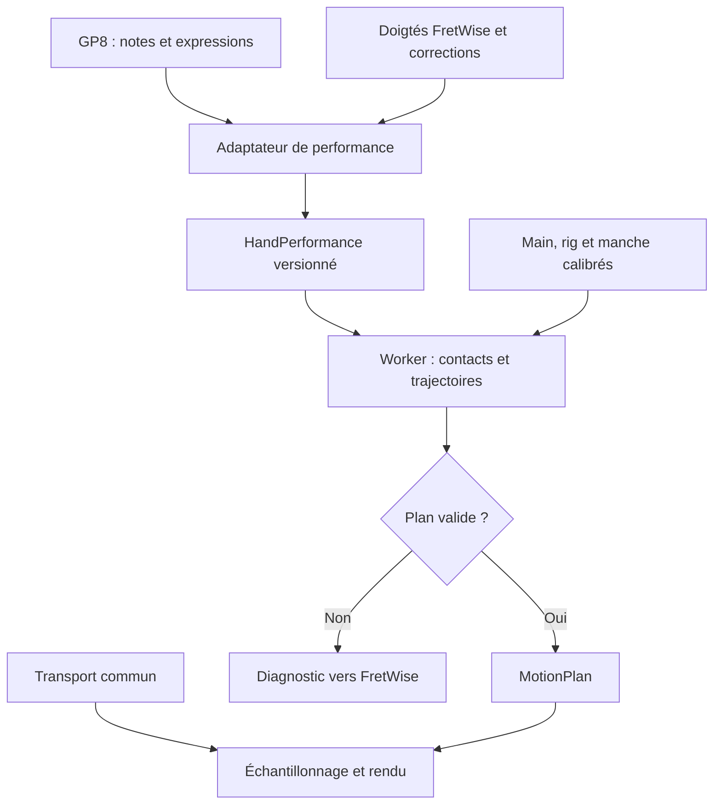

Here is the result of "fetch" for the Page with URL https://app.notion.com/p/3dbd399a325b81c9add8c5137bf4318a as of 2026-09-14T11:23:15.278Z:
<page url="https://app.notion.com/p/3dbd399a325b81c9add8c5137bf4318a" icon="🖐️">
<ancestor-path>
<parent-page url="https://app.notion.com/p/3dad399a325b81a0be7ac362bcd341a6" title="FretWise — Étude des doigtés et de l’animation 2D/3D"/>
<ancestor-2-data-source url="collection://2c4d399a-325b-80ab-bd46-000b29744593" name="Base de connaissances"/>
<ancestor-3-database url="https://app.notion.com/p/2c4d399a325b80c7b9eee9cc3ef75da5" title=""/>
<ancestor-4-page url="https://app.notion.com/p/4a13d89c2de84da29c016b6ba3f5d73a" title="Base de connaissances – Ressources"/>
</ancestor-path>
<properties>
{"title":"FretWise — Remplacement de la main 3D : spécification de réalisation"}
</properties>
<iconMetadata>{"type":"emoji","emoji":"🖐️"}</iconMetadata>
<content>
Dossier de remplacement • Version 1.2 • 14 septembre 2026 • Statut : spécification et maquette sauvegardées ; transitions, rythme et expressions spécifiés en section 19, à implémenter et valider.
**Mise à jour de réalisation :** les sections 16 à 18 conservent les corrections validées, les limites actuelles, les pièces jointes, les vérifications et le code complet en archive.
**But :** fournir au développement et à l’artiste 3D un contrat commun pour remplacer la représentation de la main sur le manche, depuis les notes et les doigtés FretWise jusqu’aux contacts, aux mouvements et au rendu.
**Rattachement :** <mention-page url="https://app.notion.com/p/3dad399a325b81a0be7ac362bcd341a6">FretWise — Étude des doigtés et de l’animation 2D/3D</mention-page>. Pour les défauts du calcul des doigtés et de son apprentissage : <mention-page url="https://app.notion.com/p/3dad399a325b817d80cedaa240137f39"/>.
**Base examinée :** [targuy/fretwise, master, commit 64470ebd10cf19a0ff3a53ce087a6914bd7aefe3](https://github.com/targuy/fretwise/tree/64470ebd10cf19a0ff3a53ce087a6914bd7aefe3). Lecture ciblée du code et inspection des métadonnées des deux GLB. Les captures et les remarques de Benoît documentent aussi les échecs des maquettes réalisées dans la conversation. Ces maquettes ne constituent pas une version validée du dépôt.
**Limites de cette étude :** aucun nouveau mesh photoréaliste livré, aucun moteur remplacé, aucune performance mesurée sur appareil. Les seuils ci-dessous sont des objectifs de recette. Le choix définitif du modèle dépend de sa validation visuelle, de son rig et de ses droits d’utilisation.
<table_of_contents/>
## 1. Décisions structurantes
Construire une main à peau continue, pilotée par un squelette anatomiquement organisé et des déformations correctives. Résoudre les contacts de toute la main avant de produire les images. Utiliser une seule chronologie pour la notation, le son et la main.
- Conserver Python/FastAPI et Three.js. Respecter l’interface publique de M5/Viterbi décrite dans le dépôt.
- Le moteur de doigtés décide du couple corde/case et du doigt. Le planificateur de mouvement vérifie sa faisabilité et produit les poses. Le rendu applique ces poses. Une pose impossible remonte un diagnostic ; elle ne provoque ni allongement des doigts ni changement silencieux de doigté.
- La main gauche de frettage est la cible initiale. Une main droite de frettage demande un rig miroir validé ; tourner la caméra ne change pas la latéralité.
- Le pouce repose par défaut par sa pulpe sur le dos du manche, avec une prise adaptée au passage. L’appui sur la pointe et le pouce passant au-dessus sont des modes explicites, pas des comportements automatiques.
- Le réalisme géométrique est une condition préalable : valider la main ouverte et plusieurs prises fixes avant d’ajouter les transitions.
- Prévoir un mode de diagnostic montrant os, axes et contacts ; le masquer dans la présentation normale.
**Périmètre certifié initial :** une piste de guitare à six cordes, toutes ses voix simultanées, notes ordinaires, accords ouverts, barrés, maintiens, démanchés, pause, recherche temporelle et boucle. Le contrat transporte toutes les expressions dès le départ ; chacune n’est annoncée comme animée qu’après sa recette. La main qui attaque les cordes reste hors du premier lot.
## 2. Critique de l’existant et des essais
### 2.1 Constats dans le dépôt
<table fit-page-width="true" header-row="true">
<tr>
<td>Constat vérifié</td>
<td>Conséquence</td>
<td>Remplacement prévu</td>
</tr>
<tr>
<td>hand3d.js comporte plusieurs chemins : géométrie procédurale, main articulée, GLB et repli. Le chargement GLB peut échouer et conserver le rendu procédural.</td>
<td>La disponibilité visuelle ne dit pas quel niveau de qualité est réellement actif.</td>
<td>Un moteur v2 identifiable, un état de chargement et un repli annoncé comme schématique.</td>
</tr>
<tr>
<td>Le chargement de rigged_hand_baked.glb affecte o.material = this.skinMat aux meshes conservés.</td>
<td>Les matériaux/textures du fichier ne sont pas automatiquement ceux du rendu final.</td>
<td>Matériaux de peau et d’ongles qualifiés, préservés ou remplacés intentionnellement.</td>
</tr>
<tr>
<td>Le mapping du pouce utilise thumb.01.L, thumb.02.L et thumb.03.L. Les réglages de swing, roll et flex sont empiriques.</td>
<td>Trois noms d’os ne prouvent pas trois phalanges : il faut identifier métacarpien, MCP et IP. L’axe local supposé peut produire des flexions erronées.</td>
<td>Manifeste sémantique du rig, axes par articulation, poses de calibration et appui surfacique.</td>
</tr>
<tr>
<td>La main GLB est positionnée avec une orientation globale et un ancrage de centroïde. Des compensations visuelles de paume existent.</td>
<td>Une silhouette peut sembler corrigée alors que les contacts et la base du pouce restent faux.</td>
<td>Ancrage au carpe ; transformation commune au mesh, au squelette et aux volumes de collision.</td>
</tr>
<tr>
<td>_easeAndApplyPose lisse après résolution : constante d’environ 110 ms au poignet et 60 ms aux doigts.</td>
<td>L’animation peut arriver après l’instant musical ; une interpolation de poses valides ne garantit pas un trajet valide.</td>
<td>Trajectoires anticipées avec échéance de contact et contrôles intermédiaires.</td>
</tr>
<tr>
<td>_buildHandVizPayload utilise un tempo global et impose au moins 80 ms par note. L’export autonome applique le tempo local à un décalage depuis la première note.</td>
<td>Ces conversions ne remplacent pas l’intégration d’une carte de tempo. Les origines de temps diffèrent aussi entre chemins.</td>
<td>Une chronologie d’exécution partagée, avec silences initiaux, reprises et tempos.</td>
</tr>
<tr>
<td>Le payload de la main transmet surtout corde, case, doigt, position, voix et planted ; les expressions détaillées ne sont pas transportées.</td>
<td>Le rendu ne peut pas reconstruire fidèlement bends, legatos, harmoniques et étouffements à partir de ces seuls champs.</td>
<td>HandPerformance versionné, relations de techniques et courbes conservées.</td>
</tr>
<tr>
<td>_parse_bend réduit les points GPIF à une amplitude maximale et un type.</td>
<td>Deux courbes différentes peuvent devenir la même entrée d’animation.</td>
<td>Préserver les points et leur sémantique temporelle dès le parseur, avec provenance.</td>
</tr>
<tr>
<td>Le cache mémorise des poses, avec une clé basée sur la signature cinématique et l’ancrage.</td>
<td>Cette clé ne décrit pas une future trajectoire dépendant du profil de main, de l’instrument, de la vitesse et du contexte.</td>
<td>Séparer cache de poses et cache de mouvements ; inclure leurs dépendances.</td>
</tr>
</table>
Sources de ces constats : [hand3d.js](https://github.com/targuy/fretwise/blob/64470ebd10cf19a0ff3a53ce087a6914bd7aefe3/src/fretwise/web/static/js/hand3d.js), [main.js](https://github.com/targuy/fretwise/blob/64470ebd10cf19a0ff3a53ce087a6914bd7aefe3/src/fretwise/web/static/js/main.js), [export/hand_viz.py](https://github.com/targuy/fretwise/blob/64470ebd10cf19a0ff3a53ce087a6914bd7aefe3/src/fretwise/export/hand_viz.py), [gpif_adapter.py](https://github.com/targuy/fretwise/blob/64470ebd10cf19a0ff3a53ce087a6914bd7aefe3/src/fretwise/parser/gpif_adapter.py), [pose_cache.js](https://github.com/targuy/fretwise/blob/64470ebd10cf19a0ff3a53ce087a6914bd7aefe3/src/fretwise/web/static/js/pose_cache.js).
### 2.2 Échecs des maquettes à transformer en tests
Les photos montrent une main qui enveloppe un manche, avec une paume creusée, un volume thénar continu et un pouce opposé aux doigts. Les captures des essais montrent au contraire, selon les versions : un pouce mal implanté, une paume latérale cassée, des replis pointus, des articulations étranglées, des rotations improbables et un poignet raccordé comme un cylindre.
Ces défauts ne se corrigent pas avec une texture plus détaillée ou une rotation globale supplémentaire. Il faut vérifier ensemble la topologie, les pivots, les poids de peau, les axes locaux, les poses et les collisions.
**Références de recette issues de la conversation :** IMG_0297/0296/0295 pour le dos du manche et le pouce ; IMG_4386/4387/4388 pour la paume et la prise ; IMG_4376 pour l’étranglement des articulations ; IMG_4381 à IMG_4377 pour les torsions du pouce ; IMG_4382 à IMG_4384 pour son implantation et le bord de paume. Ces noms identifient les pièces de la conversation, sans prétendre qu’elles sont jointes à cette page. La photo de tenue du médiator sert à observer la peau et les volumes, pas à imposer une pose de frettage.
Les photos sont des références visuelles, pas un relevé 3D ni une texture à projeter telle quelle. Constituer ensuite un jeu de références autorisé, avec vues paume/dos/profil et transitions filmées, pour l’actif livré.
## 3. Anatomie fonctionnelle à représenter
### 3.1 Squelette et proportions
Le pouce possède deux phalanges, proximale et distale. Le premier métacarpien est une structure distincte située à sa base, dans le volume de la main ; les quatre autres doigts possèdent trois phalanges. Cette distinction doit apparaître dans le rig, le manifeste et le mode os. [OpenStax, os du membre supérieur](https://openstax.org/books/anatomy-and-physiology-2e/pages/8-2-bones-of-the-upper-limb).
L’implantation osseuse et le point où le pouce sort visuellement de la peau ne se confondent pas. La racine CMC se situe près du carpe, côté radial. Le métacarpien se prolonge dans l’éminence thénar jusqu’à MCP ; la commissure pouce-index relie des surfaces de peau.
- Chaque doigt a ses longueurs de segments, ses diamètres, ses pulpes et sa position MCP propres. Le majeur est le plus long dans le profil initial ; l’ordre index/annulaire dépend du modèle choisi.
- Mesurer les longueurs au repos entre centres articulaires, puis ajouter séparément l’enveloppe de peau et la pulpe. Ne pas estimer une longueur à partir de sa projection sur une photo en perspective.
- Les dimensions sont immuables pendant un morceau. La personnalisation de taille prépare un nouveau rig au repos, ses poids et ses collisions ; aucun segment ne s’étire pour atteindre une case.
- Les ratios actuels du code sont des paramètres de prototype, pas une vérité anthropométrique à recopier.
### 3.2 Articulations et axes
Le rig de production simplifie la biomécanique, mais ses simplifications doivent être déclarées. Les rotations se font autour d’axes calibrés dans le repère local de chaque articulation, relativement à la pose de repos. Éviter un axe mondial commun à tous les doigts.
<table fit-page-width="true" header-row="true">
<tr>
<td>Zone</td>
<td>Contrôles retenus</td>
<td>Règle de mouvement</td>
</tr>
<tr>
<td>Avant-bras</td>
<td>Pronation/supination, distribuée sur des os de torsion</td>
<td>La rotation de l’avant-bras ne doit pas être concentrée en une vrille au poignet.</td>
</tr>
<tr>
<td>Poignet</td>
<td>Flexion/extension et déviation radiale/ulnaire</td>
<td>Limites couplées au profil et au contexte ; continuité avec l’avant-bras.</td>
</tr>
<tr>
<td>Paume / métacarpiens II–V</td>
<td>Courbure des arches et creusement de la paume</td>
<td>Index/majeur relativement stables ; mobilité différenciée du côté annulaire/auriculaire. Pas quatre charnières identiques.</td>
</tr>
<tr>
<td>Doigts, MCP</td>
<td>Flexion et écartement</td>
<td>L’écartement admissible diminue avec la flexion ; éviter une torsion axiale libre.</td>
</tr>
<tr>
<td>Doigts, PIP et DIP</td>
<td>Flexion principalement</td>
<td>Couplage souple PIP/DIP, modifiable pour barré et technique. Pas de curl global obligatoire.</td>
</tr>
<tr>
<td>Pouce, CMC</td>
<td>Abduction/adduction et opposition, avec rotation couplée</td>
<td>Manifeste et poses définissent une enveloppe admissible ; pas trois rotations libres indépendantes.</td>
</tr>
<tr>
<td>Pouce, MCP puis IP</td>
<td>Flexion principalement dans la convention simplifiée</td>
<td>Deux phalanges après MCP ; aucune PIP fictive ; faible flexion possible pour un appui large.</td>
</tr>
</table>
Les bornes numériques doivent être livrées avec le profil de rig et vérifiées sur les poses de référence. Ne pas inventer une plage universelle de degrés en mélangeant axes anatomiques, rotations Blender et angles Euler Three.js. Chaque contrôle précise son axe unitaire, sa position neutre, son signe positif, sa plage et ses couplages.
### 3.3 Paume, peau et appui du pouce
La paume forme une coque souple et asymétrique : volume thénar côté pouce, volume hypothénar côté auriculaire, creux central et commissures. Le contour radial doit se prolonger du poignet vers la base du pouce sans trou, pointe, disque ajouté ou cassure.
En flexion, la peau se comprime côté palmaire et se tend côté dorsal. Des plis locaux sont normaux ; un étranglement de tout le doigt ne l’est pas. Les correctifs doivent maintenir une masse crédible avec compression et renflement local, sans imposer un diamètre rigoureusement constant.
Le mode par défaut, nommé **back_pad**, recherche une zone de contact de la pulpe sur le dos arrondi du manche. Il contraint plusieurs points et la normale de la pulpe, pas seulement l’extrémité de l’os distal. Une légère flexion IP reste possible. Il ne force pas tout le pouce à devenir une barre plate.
Le pouce peut glisser ou se décharger pendant un déplacement. Le mode **over_wrap** existe seulement si le profil et le passage le permettent ; le mode **tip_support** exige une justification de pose et n’est pas choisi par défaut. Ces choix répondent à la prise demandée ici, sans prétendre qu’une même position convient à tous les styles et à tous les guitaristes.
La paume reste sous/derrière le manche dans la prise retenue. Elle peut s’en approcher selon la technique, mais son creux et la commissure gardent un espace cohérent. « Gauche de la paume » dans une capture se traduit dans le code par « côté radial/thénar », indépendamment de la caméra.
## 4. Modèle 3D, mesh et livrables graphiques
### 4.1 Choix de l’actif
**Décision :** produire ou adapter un actif dédié, nommé **hand_left_fretwise_v1**, avec validation préalable sur manche. Le fichier existant peut servir de base si son audit visuel et sa provenance passent les critères. Le nom ci-dessus désigne un livrable à réaliser ; ce n’est pas un modèle prétendument déjà disponible.
Inspection des métadonnées au commit examiné :
<table fit-page-width="true" header-row="true">
<tr>
<td>Actif</td>
<td>Données observées</td>
<td>Décision</td>
</tr>
<tr>
<td>rigged_hand.glb</td>
<td>1 550 016 octets ; deux primitives totalisant 9 669 sommets et 17 596 triangles ; deux skins de 59 joints ; deux images ; deux animations ; aucune morph target.</td>
<td>Base de comparaison. Le nombre d’os inclut des éléments des deux côtés et du bras, pas 59 articulations d’une main.</td>
</tr>
<tr>
<td>rigged_hand_baked.glb</td>
<td>1 537 592 octets ; mêmes comptes de sommets, triangles, joints, images et animations ; aucune morph target.</td>
<td>Candidat à retopologie/rigging après inspection. La mise à l’échelle hors ligne n’ajoute ni anatomie ni correctifs.</td>
</tr>
<tr>
<td>Main generic-hand du projet WebXR Input Profiles</td>
<td>Base légère utilisée dans les essais de la conversation.</td>
<td>Réserver au diagnostic et aux essais de transport du squelette. Elle n’a pas démontré le réalisme demandé.</td>
</tr>
<tr>
<td>hand_left_fretwise_v1.blend + .glb</td>
<td>Actif cible à produire : main, poignet et portion d’avant-bras, rig calibré, PBR et correctifs.</td>
<td>Choix de production si la recette statique et dynamique est réussie ; source éditable et provenance obligatoires.</td>
</tr>
</table>
Les métadonnées ne prouvent ni la qualité des textures ni celle des déformations. Les deux animations embarquées ne sont pas qualifiées comme prises de guitare. Aucune licence du modèle existant n’a été établie par l’inspection ciblée : retrouver son origine avant réutilisation ou choisir un actif avec droits explicites de modification et de distribution dans l’application.
### 4.2 Topologie et détails
- Surface de peau continue entre paume, pouce, doigts et poignet. Des meshes distincts restent acceptables pour ongles et accessoires, sans raccord visible ni déplacement incohérent.
- Boucles de géométrie autour de MCP/PIP/DIP et de MCP/IP du pouce ; densité suffisante aux commissures, au thénar et aux plis du poignet. La triangulation exportée doit conserver cette structure de déformation.
- Pulpe intégrée à la phalange distale ; pas de sphère terminale ni d’articulation représentée comme une bille. Ongles courts, convexes, avec lit et bord libre subtils.
- Paume sculptée dans plusieurs états : ouverte, légèrement creusée, opposition du pouce, flexion forte, barré. Corriger la silhouette avant les pores.
- Textures peau : couleur sans éclairage incrusté, normale fine, rugosité, occlusion modérée. Dos et paume différenciés ; plis cohérents avec la flexion, pas un bruit uniforme.
- Zone de contact : petite déformation de pulpe et pli local éventuel. La pression visuelle est un paramètre artistique borné, pas une mesure de force physique.
**Budget de départ proposé :** environ 20–40 k triangles pour la main en LOD0, LOD mobile 8–15 k, atlas 2K au premier lot. Ces budgets guident l’optimisation ; le résultat et le temps de rendu mesurés priment. Le nombre d’os correctifs et de morphs actifs est testé sur les appareils cibles.
### 4.3 Rig et fichiers à fournir
Livrer les fichiers suivants avec version et hash : source Blender, GLB de chaque latéralité et LOD, textures sources/exportées, manifeste du rig, profils de main, profils de manche, poses de référence et rapport de recette. Ajouter auteur, origine et licence des meshes et textures.
Le manifeste **hand-rig.v1.json** doit contenir :
- Correspondance des rôles sémantiques vers les nœuds exportés, avec identifiants stables. Aucun appariement par simple indice ni suppression opportuniste de caractères.
- Pose de repos, transformations locales, inverse-bind matrices cohérentes, unité, latéralité et matrice de conversion vers le repère instrument.
- Longueurs et volumes de collision par segment ; repères de pulpe et d’ongle ; ancrages de paume et de poignet.
- Axes et bornes des contrôles ; couplages ; correspondance contrôles → rotations ; poids de posture.
- Correctifs de forme, règles d’activation, masques et version du mode de skinning ayant servi à leur création.
- Pour chaque patch de contact, indices de triangles et coordonnées barycentriques de plusieurs points de peau. Mesurer le contact sur la surface déformée, pas sur le centre d’un os.
La hiérarchie sémantique minimale est la suivante :
<table fit-page-width="true" header-row="true">
<tr>
<td>Parent</td>
<td>Enfant contrôlé</td>
<td>Segment porté</td>
</tr>
<tr>
<td>forearm / forearm_twist</td>
<td>wrist</td>
<td>Carpe et base de la paume</td>
</tr>
<tr>
<td>wrist</td>
<td>index_metacarpal, middle_metacarpal, ring_metacarpal, pinky_metacarpal</td>
<td>Métacarpiens II–V dans la paume</td>
</tr>
<tr>
<td>Métacarpien d’un doigt</td>
<td>finger_mcp → finger_pip → finger_dip</td>
<td>Phalanges proximale → moyenne → distale</td>
</tr>
<tr>
<td>wrist</td>
<td>thumb_cmc</td>
<td>Premier métacarpien dans le thénar</td>
</tr>
<tr>
<td>thumb_cmc</td>
<td>thumb_mcp</td>
<td>Phalange proximale du pouce</td>
</tr>
<tr>
<td>thumb_mcp</td>
<td>thumb_ip</td>
<td>Phalange distale du pouce</td>
</tr>
<tr>
<td>Dernière phalange</td>
<td>Repères tip, pad et nail</td>
<td>Repères sans phalange supplémentaire</td>
</tr>
</table>
**Test d’import obligatoire :** charger la pose de repos, appliquer séparément une petite rotation positive à chaque contrôle et vérifier son sens dans quatre vues. Vérifier la chaîne du pouce par son rôle et sa géométrie, pas seulement par le nombre de nœuds.
Appliquer les conversions d’unité et de repère de façon cohérente au mesh, au squelette et au bind. Ne pas reproduire l’affirmation générale du prototype selon laquelle tout scale après chargement serait interdit : le problème est une incohérence de transformations. Pour simplifier le contrat v1, exporter en mètres, transformations de repos propres, sans scale non uniforme animé.
### 4.4 Déformations en flexion et torsion
**Chemin de référence proposé :** skinning linéaire GPU avec poids soignés, os correctifs de paume et morph targets pilotées par la pose. Qualifier ce chemin avant toute optimisation. Si les torsions et flexions requises échouent malgré ce travail, évaluer un chemin DQS GPU et recréer/valider les correctifs avec ce même déformeur.
Les quaternions duaux réduisent des défauts de mélange linéaire ; ils ne créent ni une paume juste, ni des limites articulaires, ni une collision peau/manche. Ils ne garantissent pas à eux seuls la conservation physique du volume. [Kavan et al., 2008](https://users.cs.utah.edu/~ladislav/kavan08geometric/kavan08geometric.html).
Le GLB standard décrit notamment du skinning linéaire et des morph targets. Activer « Preserve Volume » dans Blender ne constitue donc pas un contrat de déformation DQS automatiquement reproduit par le moteur. Les morphs de position/normale sont appliquées avant les transformations de skinning ; leurs deltas doivent être exportés dans l’espace approprié. [Spécification glTF, géométrie et skins](https://registry.khronos.org/glTF/specs/2.0/glTF-2.0.html#geometry).
Correctifs à livrer au minimum : flexion forte de chaque doigt, opposition du pouce, creusement de paume, pli du poignet, jonction thénar, barré de l’index et compression de pulpe. Éviter la simple addition de correctifs incompatibles ; prévoir des correctifs combinés ou une interpolation par poses voisines.
En option DQS : normaliser les poids et les quaternions, aligner leur signe avant mélange, utiliser les transformations relatives au bind, déformer aussi normales et tangentes. Appliquer exactement le même déformeur dans les passes de couleur, profondeur et ombre, ainsi que dans les mesures CPU de contact. Aucun double skinning.
## 5. Manche et conventions de géométrie
**Repère instrument conservant l’orientation générale du code existant :** X du sillet vers le chevalet ; Y sort de la touche ; Z traverse la largeur vers le côté des cordes aiguës. Le repère est orthonormé direct. Le dos du manche est du côté Y négatif ; le bas de l’écran n’est pas une convention anatomique.
Toutes les distances échangées sont en mètres, les angles en radians, les quaternions dans l’ordre x,y,z,w. Les outils d’auteur peuvent afficher des millimètres ou des degrés, mais convertissent une seule fois. Les positions de l’interface 2D ne déterminent jamais les coordonnées 3D.
Le profil de l’instrument décrit : diapason, nombre de frettes, accordage de chaque corde, largeur au sillet et en plusieurs sections, positions latérales des cordes, rayon de touche, hauteur et largeur des frettes, action, profil du dos, sillet et capo. Mesurer si possible ; sinon déclarer un profil nominal. Une dimension absente ne devient pas une mesure réelle.
Pour un manche tempéré, la position nominale de la frette n est :
```plain text
x_fret(n) = scaleLengthM * (1 - 2^(-n / 12))
point_frettage = point sur la corde, côté sillet de la frette n
x_fret(n-1) < x_contact < x_fret(n)
p_monde = instrumentToWorld * p_instrument
```
Le décalage de contact est choisi en mètres selon la taille de pulpe et la place disponible ; pas au milieu arbitraire de la case. Tenir compte de l’arrondi de touche, des couronnes et de la corde abaissée. Pour une harmonique naturelle, viser un nœud de corde avec toucher léger : la règle du contact « derrière la frette » ne s’applique pas.
**Numérotation :** corde 1 = corde aiguë de référence ; la liste d’accordage est explicitement indexée, jamais interprétée implicitement comme grave→aigu. Les cases du contrat sont absolues depuis le sillet. Avec capo, un doigt « open » se situe à la case du capo ; l’affichage peut soustraire cette case. Un accordage ouvert MIDI se réfère à la corde sans capo.
Dans une note frettée ordinaire, basePitchMidi doit correspondre à openPitchMidi + fretAbs. Les bends et harmoniques portent leurs données propres ; ne pas ajouter le capo deux fois.
Le manche de collision doit correspondre au manche visible. Modéliser les cordes comme des courbes avec appuis au sillet/capo, frettes actives et chevalet. Une corde pressée change localement de hauteur. Une corde bendée se déplace latéralement ; une ligne droite rigide sous le doigt donnerait un faux contact.
## 6. Architecture et responsabilités
Le backend conserve et normalise l’information musicale. Un module TypeScript pur, exécuté dans un Web Worker, construit les contacts, résout la main et prépare les trajectoires. Le thread principal Three.js affiche le résultat. Le même module de calcul peut s’exécuter sous Node pour les tests et les exports ; éviter deux solveurs divergents en Python et JavaScript.

**Répartition proposée :**
- Python : enrichir le parseur, préserver les identifiants de source, dérouler les reprises avec le transport, convertir les résultats en HandPerformance et valider le JSON.
- TypeScript partagé : géométrie du manche, cinématique, limites, contact, trajectoires, diagnostics et échantillonnage déterministe.
- Worker : compilation par fenêtres avec recouvrement, annulation et cache. Il ne crée ni DOM ni objets WebGL.
- Thread principal : chargement des actifs, application des rotations/morphs, matériaux, lumière, caméra et interface.
- FretWise : affichage des erreurs et modification éventuelle des doigtés par son moteur ou par l’utilisateur. Le renderer ne fait pas cette modification.
**Invariant :** un plan et un échantillonnage ne dépendent pas de la caméra. Une recherche temporelle à t doit restituer le même état qu’une lecture continue à t.
## 7. Contrat d’entrée FretWise → main
### 7.1 Chronologie et identité
Nom du document : **HandPerformance**, version **1.0**. Les types ci-dessous forment le contrat proposé à implémenter, pas une API déjà présente.
La référence musicale est le tick d’exécution déroulé, avec PPQ explicite. Chaque passage d’une reprise reçoit un occurrenceId distinct et conserve son sourceNoteId. Ne pas déduire l’identité du couple corde/case.
La carte de tempo décrit des microsecondes par noire, avec segments constants dans v1. Pour convertir un tick en seconde, intégrer tous les segments précédents. Exemple de contrôle : PPQ 960, tempo 120 jusqu’au tick 1920 puis 60 ; le tick 3840 doit être à 3 secondes, pas 2 ou 4.
Les silences initiaux restent présents. Si le document exporte un extrait, préciser son origine ; la scène ne recale pas spontanément la première note à zéro. Les rampes de tempo, si la source en contient, sont soit intégrées par le transport commun, soit déclarées non prises en charge ; elles ne sont pas aplaties silencieusement.
Distinguer fin notée, fin sonore planifiée et fin de contact physique. La fin sonore correspond au planning du lecteur, pas à la disparition acoustique exacte de toute résonance. Let-ring, liaisons et étouffements ne peuvent pas être remplacés par une durée minimale de 80 ms.
```typescript
type Tick = number; // entier >= 0 ; même PPQ pour tout le document
type Finger = "open" | "index" | "middle" | "ring" | "pinky" | "thumb";
type Vec3 = [number, number, number]; // mètres
type Quat = [number, number, number, number]; // x,y,z,w, normalisé
type Provenance = "source" | "user" | "computed" | "inferred";

interface TempoPoint {
  tick: Tick;
  usPerQuarter: number; // strictement positif
}
interface Fingering {
  finger: Finger;
  stringNo: number;     // entier 1..N
  fretAbs: number;      // entier depuis le sillet
  handPositionHint?: number; // préférence, pas ancrage rigide
  provenance: Provenance;
  locked: boolean;
  confidence?: number; // seulement si calibrée ; sinon absent
}
interface PlayedNote {
  occurrenceId: string;
  sourceNoteId: string;
  voiceId: string;
  onTick: Tick;
  notatedEndTick: Tick;
  soundEndTick: Tick;   // fixé par la performance audio normalisée
  basePitchMidi: number;
  velocity: number;    // 0..127 ; ne devient pas directement une force
  fingering: Fingering;
  expressionIds: string[];
}
interface Curve {
  interpolation: "linear"; // v1, pas de spline avec dépassement implicite
  points: Array<{tick: Tick; value: number}>; // temps absolus déroulés
}
interface ExpressionBase {
  id: string;
  noteIds: string[];     // occurrenceIds, jamais IDs ambigus d'une reprise
  startTick: Tick;
  endTick: Tick;
  provenance: Provenance;
}
type Expression = ExpressionBase & (
  | {kind: "bend"; cents: Curve;
     direction: "toward_bass" | "toward_treble" | "auto";
     preBend: boolean}
  | {kind: "vibrato"; cents: Curve;
     mechanism: "lateral" | "longitudinal" | "unspecified"}
  | {kind: "slide"; fromId: string; toId: string;
     mode: "legato" | "shift"}
  | {kind: "hammer_on" | "pull_off"; fromId: string; toId: string}
  | {kind: "tie" | "let_ring" | "staccato" | "dead_note"}
  | {kind: "harmonic"; mode: "natural" | "artificial";
     nodeXM?: number; soundingPitchMidi: number}
  | {kind: "palm_mute" | "tremolo_picking" | "pick_attack"}
  | {kind: "trill"; fromId: string; toId: string; rateHz: number}
  | {kind: "unknown"; sourceKind: string; raw: unknown}
);
interface BarreHint {
  id: string;
  finger: Exclude<Finger, "open">;
  fretAbs: number;
  stringNos: number[];
  startTick: Tick;
  endTick: Tick;
  locked: boolean;
}
interface HoldHint {
  finger: Exclude<Finger, "open">;
  stringNo: number;
  fretAbs: number;
  startTick: Tick;
  endTick: Tick;
  provenance: Provenance;
}
interface HandPerformance {
  schemaVersion: "1.0";
  scoreId: string;
  trackId: string;
  scoreRevision: string;
  fingeringRevision: string;
  ppq: number;
  range: {startTick: Tick; endTick: Tick};
  tempoMap: TempoPoint[];
  hand: {side: "left" | "right"; profileId: string; profileRevision: string};
  instrument: {
    profileId: string; profileRevision: string;
    scaleLengthM: number; fretCount: number; capoFret: number;
    strings: Array<{number: number; openPitchMidi: number}>;
  };
  notes: PlayedNote[];
  expressions: Expression[];
  barres: BarreHint[];
  holds: HoldHint[];
  diagnostics: Array<{code: string; message: string; noteIds: string[]}>;
}
```
Le profil d’instrument référencé fournit les dimensions manquantes du manche ; le profil de main fournit les mesures et les limites. Ces références sont immuables par révision et doivent être résolues avant compilation. Les transformations de présentation restent hors de ce document.
**Règles de validation du contrat :** identifiants uniques ; références existantes ; nombres finis ; intervalles ordonnés ; tempos triés sans doublon et avec un point au tick 0 ; numéros de corde valides ; cases dans le manche et au-delà du capo pour un doigt frettant ; finger=open seulement sur corde libre/capo ; fréquences de trille positives ; courbes ordonnées et couvrant leur intervalle. Rejeter une version majeure inconnue.
Conserver les techniques inconnues avec un diagnostic. Un bend sans courbe peut recevoir une courbe conventionnelle marquée inferred, mais ne doit pas être présenté comme une reproduction exacte du GP8.
Les barrés et les doigts maintenus sont des intervalles, pas une propriété sans durée. Une contrainte locked ne peut pas être supprimée pour rendre le mouvement possible. L’usage du pouce pour fretter, absent du vocabulaire historique courant, reste une extension explicitement activée ; le pouce de soutien n’est pas une note.
### 7.2 Exemple complet de performance simple
La mineur, une noire, capo 0, accordage standard. Les profils nommés sont des identifiants de livraison proposés. L’index joue corde 2 case 1, le majeur corde 4 case 2, l’annulaire corde 3 case 2 ; cordes 5 et 1 à vide. La corde 6 n’est pas attaquée : son absence ne signifie pas qu’un doigt doit l’étouffer.
```json
{
  "schemaVersion": "1.0",
  "scoreId": "demo-am",
  "trackId": "guitar-1",
  "scoreRevision": "r1",
  "fingeringRevision": "f1",
  "ppq": 960,
  "range": {
    "startTick": 0,
    "endTick": 960
  },
  "tempoMap": [
    {
      "tick": 0,
      "usPerQuarter": 500000
    }
  ],
  "hand": {
    "side": "left",
    "profileId": "adult-reference-left",
    "profileRevision": "1"
  },
  "instrument": {
    "profileId": "six-string-648",
    "profileRevision": "1",
    "scaleLengthM": 0.648,
    "fretCount": 22,
    "capoFret": 0,
    "strings": [
      {
        "number": 1,
        "openPitchMidi": 64
      },
      {
        "number": 2,
        "openPitchMidi": 59
      },
      {
        "number": 3,
        "openPitchMidi": 55
      },
      {
        "number": 4,
        "openPitchMidi": 50
      },
      {
        "number": 5,
        "openPitchMidi": 45
      },
      {
        "number": 6,
        "openPitchMidi": 40
      }
    ]
  },
  "notes": [
    {
      "occurrenceId": "n1@1",
      "sourceNoteId": "n1",
      "voiceId": "v1",
      "onTick": 0,
      "notatedEndTick": 960,
      "soundEndTick": 960,
      "basePitchMidi": 45,
      "velocity": 80,
      "fingering": {
        "finger": "open",
        "stringNo": 5,
        "fretAbs": 0,
        "provenance": "user",
        "locked": true
      },
      "expressionIds": []
    },
    {
      "occurrenceId": "n2@1",
      "sourceNoteId": "n2",
      "voiceId": "v1",
      "onTick": 0,
      "notatedEndTick": 960,
      "soundEndTick": 960,
      "basePitchMidi": 52,
      "velocity": 80,
      "fingering": {
        "finger": "middle",
        "stringNo": 4,
        "fretAbs": 2,
        "provenance": "user",
        "locked": true
      },
      "expressionIds": []
    },
    {
      "occurrenceId": "n3@1",
      "sourceNoteId": "n3",
      "voiceId": "v1",
      "onTick": 0,
      "notatedEndTick": 960,
      "soundEndTick": 960,
      "basePitchMidi": 57,
      "velocity": 80,
      "fingering": {
        "finger": "ring",
        "stringNo": 3,
        "fretAbs": 2,
        "provenance": "user",
        "locked": true
      },
      "expressionIds": []
    },
    {
      "occurrenceId": "n4@1",
      "sourceNoteId": "n4",
      "voiceId": "v1",
      "onTick": 0,
      "notatedEndTick": 960,
      "soundEndTick": 960,
      "basePitchMidi": 60,
      "velocity": 80,
      "fingering": {
        "finger": "index",
        "stringNo": 2,
        "fretAbs": 1,
        "provenance": "user",
        "locked": true
      },
      "expressionIds": []
    },
    {
      "occurrenceId": "n5@1",
      "sourceNoteId": "n5",
      "voiceId": "v1",
      "onTick": 0,
      "notatedEndTick": 960,
      "soundEndTick": 960,
      "basePitchMidi": 64,
      "velocity": 80,
      "fingering": {
        "finger": "open",
        "stringNo": 1,
        "fretAbs": 0,
        "provenance": "user",
        "locked": true
      },
      "expressionIds": []
    }
  ],
  "expressions": [],
  "barres": [],
  "holds": [],
  "diagnostics": []
}
```
Pour ajouter un bend à une note compatible, référencer une Expression par son id dans expressionIds et fournir une courbe en cents : 0 → 200 → 200 → 0 avec les ticks des quatre phases. Conserver le plateau et le retour ; une amplitude « 2 demi-tons » seule ne suffit pas. La conversion des unités GPIF doit être testée sur des fichiers connus, notamment pré-bend et release.
### 7.3 Adaptation du code existant
Créer une fonction backend **build_hand_performance(events, results, score_context, instrument, hand_profile)**. Elle joint les résultats aux événements source par identifiant, complète les champs d’expression, déroule les occurrences selon la même structure que le lecteur et produit le document validé.
Ne pas repartir uniquement de la liste frames de l’ancienne vue : des informations ont déjà été perdues à ce stade. Étendre NoteEvent et le sérialiseur de façon additive, conserver les points de bend et les liens entre notes dès l’import. Le backend reçoit les corrections manuelles finales et leur révision.
planted_fingers peut alimenter des HoldHint, à condition de reconstruire et vérifier leur intervalle. Une annotation de maintien ne dispense pas de vérifier les autres voix.
Les durées de préparation motrice se calculent ensuite en secondes au débit de lecture demandé. Les durées musicales restent en ticks ; elles ne sont pas raccourcies pour faciliter une animation.
## 8. Des notes aux contacts, puis aux poses
### 8.1 Plan de contacts
Construire les événements de toutes les voix de la piste dans une seule file temporelle. À chaque changement, conserver l’ensemble des notes et contacts encore actifs ; ne pas vérifier seulement deux notes consécutives.
Un contact doit préciser son doigt, son patch de peau, sa cible, son intervalle, son rôle et sa tolérance. La paume et le pouce de soutien font partie de la prise, même lorsqu’ils ne produisent aucune note.
```typescript
type ContactRole = "press" | "barre" | "support" | "touch_harmonic" | "mute";
interface Contact {
  id: string;
  finger: Exclude<Finger, "open">;
  patchId: string; // patch du manifeste, évalué après déformation
  role: ContactRole;
  noteIds: string[];
  startSec: number; // seconde de partition au tempo nominal
  endSec: number;
  target:
    | {kind: "string"; stringNo: number; xM: number}
    | {kind: "barre"; stringNos: number[]; fretAbs: number}
    | {kind: "neck"; regionId: string};
  maxGapM: number;
  maxCompressionM: number; // tolérance de peau, pas pénétration osseuse
}
interface MotionDiagnostic {
  code: "UNREACHABLE" | "COLLISION" | "JOINT_LIMIT" | "LOCK_CONFLICT"
      | "TECHNIQUE_UNSUPPORTED" | "MISSING_SOURCE_DATA" | "ASSET_INVALID";
  noteIds: string[];
  startSec: number;
  endSec: number;
  message: string;
  residualM?: number;
}
interface MotionPlanHeader {
  planId: string;
  performanceHash: string;
  rigHash: string;
  profileHash: string;
  geometryHash: string;
  solverVersion: string;
  playbackRate: number; // vitesse ayant servi à vérifier le mouvement
  status: "valid" | "partial" | "invalid";
  validRanges: Array<{startSec: number; endSec: number}>;
  contacts: Contact[];
  diagnostics: MotionDiagnostic[];
}
```
Le MotionPlan complet ajoute des trajectoires continues de contrôles articulaires, des transformations de racine et les paramètres de déformation des cordes. Les références de contacts sont immuables et sérialisables. Un plan partiel identifie précisément les intervalles validés ; son image ne fait pas croire que tout le morceau est certifié.
### 8.2 Solveur de main entière
Variables : position/orientation de la racine dans une enveloppe de prise, poignet, opposition du pouce, contrôles MCP/PIP/DIP, creusement de paume, zone d’appui du pouce et éventuel roulement du barré. Les longueurs osseuses ne font pas partie des variables.
**Contraintes fortes :** notes et doigtés verrouillés ; longueur des os ; limites articulaires et couplages du profil ; maintien des contacts requis ; absence de pénétration rigide du manche ; absence de collision invalidante entre doigts ; cohérence des barrés et de la corde active.
**Préférences souples :** proximité d’une prise humaine validée, faible effort de déplacement, poignet et pouce confortables dans le profil, doigts inactifs proches de leur prochain rôle, stabilité des ancrages, marge aux limites. Les poids restent dans la configuration, jamais cachés dans le rendu.
Le calcul alterne l’ajustement de la prise globale et celui des doigts, mais chaque candidat est évalué sur toute la main. Une correction du poignet doit revalider tous les contacts déjà établis.
```plain text
Pour chaque fenêtre musicale avec contexte précédent et suivant :
  1. Construire notes actives, maintiens, barrés et techniques liées.
  2. Générer quelques prises de départ depuis la bibliothèque validée.
  3. Pour chaque prise, résoudre une IK contrainte de toute la main.
  4. Évaluer la peau corrigée, les contacts, les limites et collisions.
  5. Rejeter les poses qui ne respectent pas les contraintes fortes.
  6. Relier les poses admissibles par des trajectoires vérifiées.
  7. Classer les trajectoires valides selon les préférences.
  8. Si aucune n'est valide, retourner le conflit et son intervalle.
Assembler les fenêtres en conservant état, contacts, vitesse et contexte.
```
Implémentation initiale possible : optimisation itérative à bornes, démarrages multiples sur prises connues, Jacobienne des repères de contact et moindres carrés amortis pour les mises à jour. Une pénalité dans une fonction de coût ne rend pas une contrainte réellement obligatoire : vérifier les résidus et rejeter explicitement les violations après résolution.
FABRIK ou un CCD simple peuvent initialiser une chaîne ; utilisés seuls, ils ne décrivent ni les axes du pouce, ni les contacts multiples d’un barré, ni la paume. Les étapes de projection sur les limites doivent être suivies d’une nouvelle vérification des contacts.
Le profil limite l’espace atteignable par la main et le poignet. Avec une portion d’avant-bras seulement, le système ne certifie pas la posture du coude et de l’épaule. Cette limite doit rester explicite.
### 8.3 Pouce et barrés
Le pouce cherche un appui sur une région du dos du manche, en rapport avec la prise et les doigts actifs, avec latitude pour glisser le long du manche. Optimiser position et orientation de la pulpe, puis les angles CMC/MCP/IP. Ne pas résoudre d’abord les doigts pour ensuite plier arbitrairement le pouce jusqu’au point restant.
La priorité back_pad favorise plusieurs points proches de la surface et une normale compatible. Un appui exclusivement sur la pointe ne peut pas gagner le classement par un simple raccourci de distance.
Un barré se décrit par plusieurs contacts sur le même doigt, avec roulement latéral et flexion faible si nécessaire. Un repère unique au bout de l’index ne suffit pas. Les cordes frettées plus haut par d’autres doigts restent des contraintes distinctes. La même case sur plusieurs cordes n’impose pas automatiquement un barré.
### 8.4 Collisions et déformation de peau
Utiliser des capsules/ellipsoïdes comme volumes de proximité, puis des patches de peau et un modèle du manche plus précis près des contacts. Exclure des tests de collision les volumes articulaires adjacents qui se recouvrent par construction ; ne pas exclure globalement les collisions entre doigts.
Les collisions doivent distinguer contact voulu et contact parasite. Toucher une corde non jouée peut servir à l’étouffer ; toucher une corde qui doit sonner à vide peut invalider la pose. Une collision os/manche n’est jamais corrigée en amincissant la peau.
Après application des correctifs de peau, mesurer à nouveau le contact : une morph de pulpe peut déplacer le point pourtant atteint par l’IK osseuse. Prévoir une petite boucle de correction contact/peau avec convergence bornée. En cas d’échec, remonter un diagnostic.
## 9. Animation et expressions
### 9.1 Déplacements calés sur les échéances
Les phases sont préparation → déplacement → contact → maintien → relâchement. Elles dépendent du contexte : un doigt libre peut anticiper ; un doigt maintenant une autre note doit attendre sa libération.
Les instants d’attaque sont imposés par la performance. Préparer les mouvements suffisamment tôt pour arriver au contact à ces instants. À l’ouverture d’un morceau dont la première note est à t=0, charger la pose initiale avant d’activer Lecture, ou ajouter un précompte explicite commun au son et à l’image.
Une courbe quintique de type minimum-jerk peut initialiser un trajet libre :
```plain text
u = clamp((t - t_depart) / (t_arrivee - t_depart), 0, 1)
s(u) = 10*u^3 - 15*u^4 + 6*u^5
p(t) = p_depart + s(u) * (p_arrivee - p_depart)
```
Cette formule n’est pas une solution de collision. Ajouter des points de passage de dégagement si nécessaire, puis vérifier le trajet et les angles. Les contrôles articulaires sont interpolés dans leur espace admissible ; pour la racine et les orientations libres, utiliser des quaternions continus. Une slerp entre deux poses n’apporte aucune garantie anatomique à elle seule.
Ne pas ajouter un lissage retardant les doigts après cette étape. L’amortissement libre reste possible pour la caméra ou de petits détails non contraints. Le moteur doit respecter les échéances et les contacts avant de rechercher une impression de fluidité.
Contrôler vitesse et accélération au débit réel. Si une vitesse de lecture rend une transition impossible dans le profil, signaler le problème et proposer une baisse de vitesse ou un autre doigté ; ne pas accélérer visuellement un doigt sans borne ni retarder silencieusement l’appui.
### 9.2 Techniques à traiter explicitement
<table fit-page-width="true" header-row="true">
<tr>
<td>Expression</td>
<td>Contacts et mouvement</td>
<td>Information nécessaire / limite</td>
</tr>
<tr>
<td>Note ordinaire, accord</td>
<td>Pulpe derrière la frette ; maintien jusqu’au relâchement requis.</td>
<td>Séparer durée notée, son et maintien. Accords simultanés vérifiés ensemble.</td>
</tr>
<tr>
<td>Liaison de prolongation, let-ring</td>
<td>Conserver le contact utile sans nouvelle attaque artificielle.</td>
<td>Lien de notes et fin sonore ; aucune levée automatique au changement de mesure.</td>
</tr>
<tr>
<td>Staccato</td>
<td>Relâcher la pression pour interrompre le son, avec levée limitée si adaptée.</td>
<td>Ne pas confondre toujours « fin de son » et « doigt très haut ».</td>
</tr>
<tr>
<td>Hammer-on</td>
<td>Doigt de destination frappe une corde déjà engagée, les appuis utiles restent.</td>
<td>fromId/toId ; instant de contact et amplitude de préparation.</td>
</tr>
<tr>
<td>Pull-off</td>
<td>Doigt inférieur prêt ; léger mouvement de libération compatible avec la corde.</td>
<td>Une simple disparition verticale du doigt ne représente pas le geste.</td>
</tr>
<tr>
<td>Slide legato / shift</td>
<td>Glissement avec contact pour le legato ; relâchement possible pour le shift.</td>
<td>Même corde, doigt/relations et endpoints ; déplacement en x et hauteur de corde.</td>
</tr>
<tr>
<td>Bend / pré-bend / release</td>
<td>Déplacer latéralement corde et pulpe ; doigts de soutien si la prise l’exige.</td>
<td>Courbe de hauteur en cents, direction, timing et profil mécanique de corde.</td>
</tr>
<tr>
<td>Vibrato</td>
<td>Mouvement autour de l’appui, phase continue pendant la note.</td>
<td>Courbe de cents ; mécanisme latéral ou longitudinal déclaré/inféré.</td>
</tr>
<tr>
<td>Barré</td>
<td>Maintenir plusieurs patches sur l’index ou le doigt indiqué.</td>
<td>Étendue de cordes, case, rotation latérale et contacts supérieurs.</td>
</tr>
<tr>
<td>Harmonique naturelle</td>
<td>Toucher léger au nœud, puis libération si nécessaire.</td>
<td>Position du nœud et hauteur sonore ; pas une pression à fond de case.</td>
</tr>
<tr>
<td>Harmonique artificielle</td>
<td>Distinguer frettage et toucher/attaque par l’autre main.</td>
<td>Le rôle hors main gauche est déclaré non visualisé dans le premier lot.</td>
</tr>
<tr>
<td>Dead note / étouffement</td>
<td>Contact amortissant sans frettage sonore normal.</td>
<td>Ne pas représenter toutes les notes mortes comme des notes ordinaires.</td>
</tr>
<tr>
<td>Trille</td>
<td>Alternance des deux états de contact avec doigt de base cohérent.</td>
<td>Période, endpoints, chronologie ; planifié avant affichage.</td>
</tr>
<tr>
<td>Grâce / accord arpégé</td>
<td>Attaques distinctes dans la performance ; maintien partagé si compatible.</td>
<td>Le normaliseur déroule les offsets, le renderer n’invente pas un accord simultané.</td>
</tr>
<tr>
<td>Palm mute, tremolo picking, médiator</td>
<td>Conserver l’information pour l’audio et une future main d’attaque.</td>
<td>Ne pas faire agir la paume de la main de frettage à la place de l’autre main.</td>
</tr>
</table>
**Bend :** le nombre de cents n’est pas une distance de déplacement. Fournir une relation calibrée par corde, tension/profil et case, ou une approximation artistique explicitement marquée. La courbe de hauteur reste la vérité musicale ; la corde graphique, les doigts de soutien et la rotation de prise suivent la même phase. Ne pas convertir chaque demi-ton en un nombre universel de millimètres.
**Courbes :** garder les paliers, le pré-bend, le retour et les changements de sens. Les composantes bend et vibrato s’additionnent en hauteur seulement si la normalisation de la source l’autorise ; éviter de compter deux fois un vibrato déjà inclus dans la courbe.
### 9.3 Synchronisation, pause et recherche temporelle
Le lecteur audio est l’autorité temporelle lorsqu’il joue. Le transport commun publie la seconde nominale de partition au moment de sortie estimée du son. La main, les tablatures et le curseur lisent ce même transport.
Avec Web Audio, getOutputTimestamp fournit une correspondance entre temps du contexte et horloge de performance. Utiliser cette correspondance près du temps courant ; ne pas additionner une seconde correction de latence déjà incluse. Prévoir un repli mesuré si la méthode n’est pas exploitable ou si l’audio n’a pas encore démarré. [Web Audio API, getOutputTimestamp](https://www.w3.org/TR/webaudio/#dom-audiocontext-getoutputtimestamp).
Le transport applique la vitesse une seule fois. Le moteur de main échantillonne le plan au temps fourni ; il ne multiplie pas encore les ticks, les courbes et AnimationMixer par la même vitesse.
Pause : garder la pose exacte. Seek : reconstruire directement contacts, courbes et pose à la nouvelle date, sans dépendre de la dernière image. Boucle : invalider les références de passage obsolètes et définir les maintiens à la frontière. Une transition fin→début injouable ne devient pas une exécution continue valide ; en mode exercice, autoriser un reset de pose annoncé ou un précompte.
Au retour d’un onglet masqué, récupérer le temps courant et rééchantillonner. Ne pas tenter de rattraper toutes les images perdues avec une accumulation de dt. Un changement de vitesse invalide au minimum les garanties de vitesse/accélération du plan et déclenche leur revalidation.
## 10. Programmation du rendu Three.js
### 10.1 Modules proposés
Créer un répertoire hand-v2 dans les sources du front, avec les modules suivants. Les noms sont proposés pour le remplacement ; ils ne désignent pas des fichiers déjà implémentés.
<table fit-page-width="true" header-row="true">
<tr>
<td>Module</td>
<td>Responsabilité</td>
</tr>
<tr>
<td>contracts / performance-adapter</td>
<td>Validation runtime, types générés, adaptation de HandPerformance ; aucun calcul graphique.</td>
</tr>
<tr>
<td>instrument-geometry</td>
<td>Positions de frettes, cordes, capo, profils de touche et du dos ; même source pour rendu et collisions.</td>
</tr>
<tr>
<td>rig-loader / rig-manifest</td>
<td>GLTFLoader, vérification des rôles, bind, latéralité, matériaux et capacités.</td>
</tr>
<tr>
<td>kinematics / contact-solver</td>
<td>FK, IK, axes, limites, couplages, patches et collisions ; calcul pur.</td>
</tr>
<tr>
<td>motion-compiler.worker / trajectory</td>
<td>Planification des phases, anticipation, fenêtres, annulation, validation et cache.</td>
</tr>
<tr>
<td>pose-sampler / skin-deformer</td>
<td>Échantillonnage déterministe et évaluation identique de la peau pour rendu et contacts.</td>
</tr>
<tr>
<td>hand-scene / materials / camera</td>
<td>Objets Three.js, éclairage, matériaux, vue et interactions.</td>
</tr>
<tr>
<td>transport-adapter / diagnostics</td>
<td>Temps commun, révisions, événements de statut et mesures.</td>
</tr>
</table>
GLTFLoader importe le fichier ; SkinnedMesh associe géométrie, squelette, indices et poids. Préserver les données du rig et vérifier les attributs requis. Ces composants chargent et déforment un actif ; ils ne valident pas sa prise de guitare. [GLTFLoader](https://threejs.org/docs/pages/GLTFLoader.html), [SkinnedMesh](https://threejs.org/docs/pages/SkinnedMesh.html).
Les clips d’AnimationMixer peuvent fournir une pose de repos ou des références artistiques. Ils ne doivent pas réécrire après l’IK les os déjà contraints. Si un mixer est utilisé pour une base temporelle, garder timeScale à 1 et choisir un temps absolu ; setTime applique déjà timeScale. [AnimationMixer](https://threejs.org/docs/pages/AnimationMixer.html).
### 10.2 Ordre d’une image
```plain text
1. Lire une seule fois la position du transport.
2. Échantillonner le MotionPlan valide pour cette date et cette révision.
3. Appliquer la pose de base, puis les contrôles articulaires planifiés.
4. Évaluer les correctifs dépendant de cette pose.
5. Mettre à jour les matrices, les morph weights et les cordes.
6. Vérifier les probes de contact si le mode diagnostic est actif.
7. Mettre à jour caméra, annotations et ombres, puis dessiner.

Dans le déformeur : morphs en espace de repos -> skinning -> repère monde.
La mesure CPU des patches suit le même ordre que le shader.
```
Ne pas déplacer seulement le mesh de paume après cette séquence. Si le contact devient faux, corriger le plan et son modèle, pas la projection visuelle. Une implémentation LBS et une éventuelle implémentation DQS utilisent chacune leurs propres résultats de validation.
Utiliser des bornes animées conservatrices ou une mise à jour adaptée pour éviter les disparitions par frustum culling. Ne pas effectuer systématiquement un parcours CPU de tous les sommets pour recentrer la main à chaque image.
### 10.3 Matières, lumière et présentation
Peau PBR non métallique, rugosité nuancée, détails de normales à plusieurs échelles et éclairage doux qui révèle les volumes. Ongles avec matériau séparé mais discret. Respecter les espaces de couleur : texture de couleur en sRGB ; normale, rugosité et masques en données linéaires.
Une diffusion sous la peau peut améliorer le rendu en gros plan, mais demande un shader/effet qualifié. Ne pas assimiler transmission ou transparence à un modèle de peau. Commencer avec un rendu PBR stable ; ajouter cette amélioration seulement si elle apporte un gain mesuré et ne détruit pas la lisibilité des contacts.
Vues à proposer : trois-quarts côté doigts, dos du manche/pouce, paume et profil. Rotation et zoom tactiles, recentrage et caméra fixe pendant la lecture. Un mode manche translucide et les repères anatomiques sont des outils de contrôle facultatifs. Les positions de pouce et de paume doivent rester plausibles sous tous les angles, pas seulement dans la vue par défaut.
La 2D anatomique future doit projeter le même état 3D. Une tablature ou un schéma de manche peut rester un rendu autonome, mais ne constitue pas un second solveur de main.
### 10.4 Performance et cycle de vie
Précharger modèle, textures et première fenêtre avant Lecture. Compiler le reste avec anticipation ; annuler les travaux dépassés lors d’un changement de piste ou de révision. Les résultats du Worker transportent des tableaux typés et des données structurées, pas des objets Three.js.
Un cache de pose inclut rig, profil, géométrie, contraintes et version du solveur. Un cache de trajectoire inclut aussi contexte avant/après, temps disponibles, expressions et vitesse de lecture. Ne pas réutiliser un mouvement uniquement parce que le nom d’accord est identique.
Cible proposée : 60 images/s sur ordinateur de référence et 30 images/s minimum sur tablette/téléphone de référence ; budgets par image 16,7/33,3 ms. Mesurer aussi les percentiles, blocages du thread principal, mémoire et chauffe. La synchronisation musicale garde la priorité lorsque la qualité graphique diminue.
Prévoir LOD, qualité d’ombres et résolution adaptés ; réduire les détails avant de supprimer des contraintes de pose. Versionner et regrouper les dépendances Three.js, loaders et décodeurs. Éviter les imports CDN « latest ».
dispose libère géométries, textures, matériaux, mixers, workers, listeners et caches. Traiter perte/restauration WebGL et changement de piste sans double animation ni fuite. Un asset manquant déclenche un message et un repli schématique explicite.
## 11. API d’intégration et messages
### 11.1 Contrat backend proposé
**Nouveau point d’entrée : POST /api/v2/hand-performance.** Le backend résout la partition et les doigtés déjà enregistrés dans FretWise ; il ne relance pas implicitement l’optimiseur. Corps proposé :
```json
{
  "scoreId": "score-42",
  "trackId": "guitar-1",
  "scoreRevision": "r7",
  "fingeringRevision": "f12",
  "range": {
    "startTick": 0,
    "endTick": 15360
  },
  "handProfileId": "adult-reference-left",
  "handProfileRevision": "1",
  "instrumentProfileId": "six-string-648",
  "instrumentProfileRevision": "1"
}
```
Réponse 200 : HandPerformance, avec les révisions réellement utilisées. Réponse 409 si les révisions demandées ne correspondent plus ; 422 si le document source ne peut pas respecter le contrat ; 404 si la piste ou la ressource n’existe pas. Réutiliser les contrôles d’accès de l’application pour les IDs. Le endpoint est une proposition à ajouter à FastAPI, pas une route observée.
Prévoir une ressource de profils versionnés, par exemple **GET /api/v2/hand-profiles/\{id\}/revisions/\{revision\}**, et un équivalent instrument. Elle expose uniquement les profils livrés ; les actifs associés ont hash et URL stables.
Les métadonnées annoncent les capacités : techniques transportées, techniques animées, mode de déformation, latéralités et limites d’instrument. L’interface distingue « donnée disponible » et « animation qualifiée ».
Faire du schéma JSON versionné l’autorité des validations, avec types TypeScript et modèles Python dérivés ou contrôlés par des tests de conformité. Une modification de sens, d’unité ou de numérotation exige une version majeure.
### 11.2 API interne du planificateur
Le plan est compilé dans le Worker, donc un endpoint HTTP de calcul de poses n’est pas nécessaire au premier lot. Ce choix garde une seule implémentation des déformations et permet un aperçu local.
```typescript
interface CompileRequest {
  requestId: string;
  performance: HandPerformance;
  rigHash: string;
  profileHash: string;
  geometryHash: string;
  playbackRate: number;
  quality: "reference" | "mobile";
}
// Worker -> main : progress | result | failed
// Chaque réponse reprend requestId et les hashes.
// Un résultat obsolète ne remplace jamais le plan courant.

interface PoseSample {
  rootPositionM: Vec3;
  rootOrientation: Quat;
  localJointRotations: Float32Array; // ordre des rôles fixé par le manifeste
  morphWeights: Float32Array;       // ordre fixé par l'asset
  stringControlPointsM: Float32Array;
  activeContactIds: string[];
  valid: boolean;
}
interface CompiledMotionPlan {
  header: MotionPlanHeader;
  trajectoryData: ArrayBuffer; // format binaire versionné avec offsets déclarés
}
interface HandMotionEngine {
  compile(request: CompileRequest, signal: AbortSignal): Promise<CompiledMotionPlan>;
  sample(plan: CompiledMotionPlan, nominalScoreSec: number, out: PoseSample): void;
}
interface HandView {
  loadAssets(rigId: string, revision: string): Promise<void>;
  setPlan(plan: CompiledMotionPlan): void;
  renderAt(nominalScoreSec: number): void;
  setCamera(view: "fingers" | "thumb" | "palm" | "profile"): void;
  setDiagnostics(enabled: boolean): void;
  dispose(): void;
}
```
Le format binaire n’est qu’une optimisation de transport ; définir d’abord une représentation JSON de référence des trajectoires pour le débogage. Les tableaux indiquent explicitement leur ordre, leurs unités et leur version. Le sampler réutilise out pour éviter les allocations par image.
Un diagnostic de pose impossible cite les occurrenceIds, le doigt, l’intervalle et la contrainte violée. Il peut demander au moteur de doigtés des alternatives. Cette boucle est bornée et respecte les verrous : une proposition alternative n’est appliquée qu’à travers FretWise et produit une nouvelle fingeringRevision.
### 11.3 Compatibilité iframe
Si hand_viz.html est conservé comme conteneur, établir un handshake versionné, puis transmettre la performance ou le plan et le transport. Valider event.origin et event.source ; utiliser l’origine exacte dans postMessage pour le même site. Le code actuel emploie « \* » pour ses envois ; le nouveau pont doit être explicite.
Message de transport proposé :
```typescript
interface TransportSnapshot {
  type: "fretwise:transport";
  protocolVersion: 1;
  sessionId: string;
  planId: string;
  sequence: number;
  status: "playing" | "paused" | "seeking" | "stopped";
  nominalScoreSec: number;
  rate: number; // > 0 ; vitesse unique
  anchorEpochMs: number; // performance.timeOrigin + performance.now()
  discontinuityId: number; // incrémenté sur seek, boucle, nouvelle piste
}
```
L’ancre epoch est une projection monotone, pas un [Date.now](http://Date.now) sujet à une remise à l’heure. Dans une iframe ayant une autre timeOrigin, convertir le temps reçu dans le même espace. En lecture, projeter brièvement nominalScoreSec avec rate × temps écoulé ; le parent réancre régulièrement. Éviter de prolonger indéfiniment une horloge devenue muette.
Ignorer les séquences anciennes, mauvais sessionId et mauvais planId. Après une discontinuité, recharger l’état à la date donnée et vider les accumulations. Quand l’intégration directe permet au composant de lire le transport commun, préférer cette voie à une seconde horloge dans l’iframe.
Le protocole doit annoncer ready, capabilities, load, loaded, transport, diagnostics et error. Chacun porte version/session/révision. Les contrôles de lecture appartiennent au parent ; la scène ne déclenche pas un autre son.
## 12. Migration depuis FretWise
**Approche : remplacement progressif derrière un flag handRenderer=v2.** Garder les sorties de notation et l’interface de l’optimiseur. Comparer sur les mêmes fichiers, les mêmes notes et la même horloge.
Les détails musicaux déjà disponibles dans [models.py](http://models.py) et dans le sérialiseur web sont à réutiliser. Le point de perte est souvent l’adaptateur de la main ; ce n’est pas une raison pour réimporter toute la partition dans le navigateur. [Modèles](https://github.com/targuy/fretwise/blob/64470ebd10cf19a0ff3a53ce087a6914bd7aefe3/src/fretwise/models.py), [API web](https://github.com/targuy/fretwise/blob/64470ebd10cf19a0ff3a53ce087a6914bd7aefe3/src/fretwise/web/app.py).
<table fit-page-width="true" header-row="true">
<tr>
<td>Élément existant</td>
<td>Action</td>
<td>Critère de bascule</td>
</tr>
<tr>
<td>parser/gpif_[adapter.py](http://adapter.py)  • [models.py](http://models.py)</td>
<td>Ajouter courbes, relations, provenance et identité d’occurrence sans supprimer les champs historiques.</td>
<td>Aller-retour des fixtures GP8 et conservation des expressions.</td>
</tr>
<tr>
<td>web/[app.py](http://app.py) / sérialisation des résultats</td>
<td>Ajouter build_hand_performance et la route v2.</td>
<td>JSON conforme et verrous conservés après correction manuelle.</td>
</tr>
<tr>
<td>main.js / _buildHandVizPayload</td>
<td>Brancher l’adaptateur v2 et le transport commun.</td>
<td>Pas de recalcul au tempo global ni de durée minimale arbitraire.</td>
</tr>
<tr>
<td>export/hand_[viz.py](http://viz.py)</td>
<td>Réutiliser la même performance normalisée pour les exports.</td>
<td>Même origine et mêmes instants que dans l’application.</td>
</tr>
<tr>
<td>hand_viz.html</td>
<td>Réduire à l’hôte, aux contrôles et au pont de transport si l’iframe est conservée.</td>
<td>Chargement et reprise d’état déterministes.</td>
</tr>
<tr>
<td>hand3d.js</td>
<td>Remplacer les solveurs et corrections visuelles par la nouvelle API de scène.</td>
<td>Contact, silhouette et temps validés sur le jeu de recette.</td>
</tr>
<tr>
<td>pose_cache.js</td>
<td>Conserver éventuellement le mécanisme LRU ; changer valeurs, clés et invalidations.</td>
<td>Aucun plan ancien après changement d’instrument, main, tempo, notes ou asset.</td>
</tr>
<tr>
<td>GLB actuels</td>
<td>Archiver comme référence, adapter ou remplacer après audit.</td>
<td>Asset cible reçu avec rig, correctifs et rapport visuel.</td>
</tr>
<tr>
<td>Vue 2D</td>
<td>Réutiliser le même plan pour une projection anatomique ultérieure.</td>
<td>Aucune divergence de doigt/contact entre les deux vues.</td>
</tr>
</table>
Une session de comparaison v1/v2 doit afficher le moteur effectivement actif et pouvoir exporter un diagnostic du passage. Une erreur de v2 n’est pas masquée par une main procédurale présentée comme le nouveau rendu.
### Articulation avec la critique des doigtés
Des tablatures annotées enseignent des choix de doigt, rarement la pose exacte du pouce, la torsion du poignet ou les mouvements de peau. Le modèle appris de doigtés ne remplace donc pas le rig ni des références gestuelles.
La planification 3D peut fournir un coût de faisabilité au moteur amont, mais ne corrige pas seule le caractère idiomatique d’une phrase. L’optimiseur doit garder son contrôle de cohérence après les suggestions apprises. Les paramètres esthétiques du shader n’entrent jamais dans le score de choix d’un doigté.
## 13. Recette et critères d’acceptation
Les seuils suivants sont des **cibles proposées**, pas des résultats déjà obtenus. La validation combine mesures, captures multiangles et examen par au moins un guitariste expérimenté et une personne compétente en rigging. Un test d’angle réussi ne suffit pas à déclarer la main réaliste.
### 13.1 Corpus minimal
Inclure : main ouverte ; flexion de chaque doigt isolé ; opposition du pouce ; prise back_pad ; Am, C, E ; Bm en case 2 et Cm en case 3 ; barré partiel ; notes mélodiques en positions V et VII ; déplacement important ; note tenue sous une autre voix ; doigts communs conservés entre accords.
Pour les expressions : hammer-on, pull-off, slide, bend avec plateau/release, pré-bend, vibrato, harmonique et étouffement. Ajouter petits doigts en portée limite, deux tailles de main calibrées, capo et accordage alternatif. Un instrument ou une latéralité non qualifiés doivent être explicitement exclus, pas transformés à l’aveugle.
Pour le temps : silence initial, changement de tempo au milieu d’une tenue, reprises, tuplet, lecture 0,5×/1×/1,5×, pause, seek dans un bend, boucle avec note tenue, changement de piste et onglet masqué.
### 13.2 Matrice de contrôle
<table fit-page-width="true" header-row="true">
<tr>
<td>Critère</td>
<td>Objectif / méthode</td>
<td>Échec bloquant</td>
</tr>
<tr>
<td>Structure du pouce</td>
<td>Vérifier CMC/métacarpien → MCP/proximale → IP/distale ; deux phalanges après MCP.</td>
<td>Troisième phalange apparente, racine déplacée ou commissure déchirée.</td>
</tr>
<tr>
<td>Longueurs osseuses</td>
<td>Invariance au repos/poses avec tolérance relative numérique de 0,1 % maximum.</td>
<td>Étirement pour rejoindre une cible.</td>
</tr>
<tr>
<td>Axes et limites</td>
<td>Rotation isolée positive et négative de chaque contrôle ; valeurs dans l’enveloppe du profil.</td>
<td>Flexion inversée, torsion libre ou inversion du thénar.</td>
</tr>
<tr>
<td>Paume et poignet</td>
<td>Quatre vues de chaque pose ; continuité du thénar, des commissures et de l’avant-bras.</td>
<td>Bord pointu, paume creuse comme une coque vide, raccord cylindrique cassé.</td>
</tr>
<tr>
<td>Flexion et volume</td>
<td>Comparer sections/volumes de référence approuvés et contours dans les poses extrêmes.</td>
<td>Étranglement artificiel, faces inversées, trou ou gonflement incohérent. Pas de seuil universel de diamètre constant.</td>
</tr>
<tr>
<td>Contact de frettage</td>
<td>Cible initiale : erreur des repères actifs de pulpe ≤ 1,5 mm, mesurée sur peau déformée.</td>
<td>Contact sur la mauvaise corde/case ou appui visuellement flottant.</td>
</tr>
<tr>
<td>Pouce plaqué</td>
<td>Au moins trois probes du patch de pulpe dans la tolérance d’appui du profil ; normale cohérente.</td>
<td>Seule la pointe touche dans le mode back_pad, malgré une solution de prise large.</td>
</tr>
<tr>
<td>Collisions</td>
<td>Aucune pénétration des volumes rigides ; compression de peau bornée par patch.</td>
<td>Traversée de manche/corde ou contact parasite qui étouffe une corde attendue sonore.</td>
</tr>
<tr>
<td>Transitions</td>
<td>Contrôles adaptatifs et collisions balayées entre clés ; contacts actifs maintenus.</td>
<td>Trajet invalide entre deux poses fixes valides.</td>
</tr>
<tr>
<td>Temps</td>
<td>Cible : contacts planifiés exactement à l’échéance et écart visuel/audio ≤ 20 ms sur machine de référence.</td>
<td>Retard systématique par easing ; dérive sur tempo/reprise. À 30 images/s, documenter la quantification jusqu’à une image.</td>
</tr>
<tr>
<td>Source et expressions</td>
<td>100 % des notes/occurrences/verrous conservés dans le périmètre testé ; courbes et liens vérifiés.</td>
<td>Expression inventée comme issue de la source ou note déplacée silencieusement.</td>
</tr>
<tr>
<td>Reproductibilité</td>
<td>Même pose/contacts au même t en lecture, pause et seek, à tolérance numérique déclarée.</td>
<td>État dépendant du nombre d’images déjà rendues.</td>
</tr>
<tr>
<td>Rendu/performance</td>
<td>Fréquence et mémoire mesurées sur ordinateur, iPad et téléphone retenus pour la recette.</td>
<td>Blocages à chaque accord, fuites sur changement de piste ou perte silencieuse du rig.</td>
</tr>
</table>
Pour le pouce, les probes sont espacées sur une zone surfacique significative, pas trois points presque confondus à l’extrémité. La tolérance n’autorise pas à traverser le manche. Pour les doigts, adapter les probes au barré et à l’harmonique.
Les collisions se testent à la résolution temporelle nécessaire au mouvement ; une vérification seulement à 30 ou 60 images/s peut manquer une traversée rapide. Les contrôles continus/échantillonnages adaptatifs doivent être resserrés en cas de proximité ou de forte vitesse.
Les métriques de performance indiquent matériel, navigateur, résolution, qualité et version du rig. Comparer le contenu réellement rendu, avec ombres et correctifs activés. Ne pas extrapoler un résultat de bureau au mobile.
### 13.3 Tests à écrire
- Tests de géométrie : frettes, rayon, largeur, capo, ordre des cordes et conversion d’unités.
- Tests de contrat : schémas, références, tempo intégré, reprises et courbes. Les tuplets exigent un PPQ permettant leur représentation exacte ou une politique explicite de précision ; aucun arrondi silencieux.
- Tests du rig : rôles manquants, bind, axes, poids, probes après morph et skinning. Tests séparés par déformeur.
- Tests du planificateur : notes maintenues de toutes les voix, barrés, conflits verrouillés, trajets trop courts, changements de profil et annulation.
- Tests de transport : pause, seek, loop, débit, messages périmés et récupération après suspension.
- Comparaisons visuelles : même caméra, lumière, pose et paramètres ; conserver références et tolérances. Ajouter une revue humaine pour les changements d’asset, de poids et de correctifs.
Ne pas écrire des tests qui vérifient seulement la présence de mots « thumb » ou « two phalanges ». Mesurer la chaîne, la déformation et les contacts réellement produits.
## 14. Ordre de réalisation et livrables de chaque lot
<table fit-page-width="true" header-row="true">
<tr>
<td>Lot</td>
<td>Travail concret</td>
<td>Condition pour continuer</td>
</tr>
<tr>
<td>L0 — Référentiel</td>
<td>Figer commit, fixtures GP8, erreurs illustrées, repère et contrat. Produire le validateur HandPerformance.</td>
<td>Exemples et temps reproduits sans perte ; aucune confusion source/prototype.</td>
</tr>
<tr>
<td>L1 — Actif de main</td>
<td>Auditer le GLB existant, produire/adapter le modèle cible, rig, textures et correctifs.</td>
<td>Main ouverte et flexions isolées correctes en quatre vues ; source éditable et droits identifiés.</td>
</tr>
<tr>
<td>L2 — Prises statiques</td>
<td>Construire manche paramétré et solveur de contacts : back_pad, accords ouverts, barrés.</td>
<td>Paume, pouce et doigts corrects simultanément ; aucune correction uniquement visuelle.</td>
</tr>
<tr>
<td>L3 — Trajectoires</td>
<td>Planifier préparations, maintiens, libérations et démanchés ; collisions intermédiaires.</td>
<td>Arrivée à temps, contact stable et trajet admissible.</td>
</tr>
<tr>
<td>L4 — Intégration</td>
<td>Route FastAPI, Worker, transport commun, mode v2, diagnostics et export.</td>
<td>Même état depuis lecture/seek ; verrous et révisions respectés.</td>
</tr>
<tr>
<td>L5 — Expressions</td>
<td>Ajouter les techniques par groupes, avec fixtures et revue gestuelle.</td>
<td>Une technique est annoncée disponible seulement après sa recette.</td>
</tr>
<tr>
<td>L6 — Optimisation et bascule</td>
<td>LOD, mémoire, mobile, régression, documentation et retrait progressif de v1.</td>
<td>Rapport complet sur appareils cibles et acceptation visuelle.</td>
</tr>
</table>
L1 est une étape de modélisation/rigging à part entière. Elle ne doit pas être remplacée par une succession de réglages d’angles dans le navigateur. Le livrable d’un lot est observable : actif, contrat, séquence validée ou rapport de test, pas seulement un changement de code.
### Points à fixer pendant L0/L1, sans bloquer la rédaction de cette spécification
Choisir le modèle de main de référence et sa taille mesurée ; récupérer la provenance de l’actif existant ; définir le profil de manche nominal et les appareils de recette ; arrêter les premières expressions certifiées ; valider les enveloppes d’angles du rig avec leurs poses.
À l’initialisation, le Worker reçoit manifeste, profils et géométrie de calcul, mis en cache par hash. Une CompileRequest dont un hash n’est pas résolu échoue avec ASSET_INVALID. Les chemins source proposés et les identifiants d’actifs de cette page doivent être créés pendant ces lots.
Le résultat attendu est une représentation crédible et contrôlée sur un périmètre déclaré. Une partition et ses doigtés ne déterminent pas une gestuelle humaine unique ; lorsque plusieurs prises sont valides, choisir une prise de référence cohérente avec le profil et conserver ses choix dans le temps.
## 15. Références et statut de validation
**Références projet :** [architecture](https://github.com/targuy/fretwise/blob/64470ebd10cf19a0ff3a53ce087a6914bd7aefe3/docs/fretwise_architecture.md), [conception des données](https://github.com/targuy/fretwise/blob/64470ebd10cf19a0ff3a53ce087a6914bd7aefe3/docs/fretwise_conception_donnees.md), [plan projet](https://github.com/targuy/fretwise/blob/64470ebd10cf19a0ff3a53ce087a6914bd7aefe3/docs/fretwise_plan_projet.md). Les sources de code et les documentations techniques sont liées près des constats correspondants.
**Vérifié pour ce dossier :** présence et structure des points d’intégration ; traitement du temps et des données de la main ; mapping et chargement du rig ; nombre de sommets, triangles, skins, images, animations et absence de morph targets dans les deux GLB.
**Non vérifié / à livrer :** qualité visuelle de l’actif cible, rig corrigé, solveur v2, validité des prises et animations, performances sur appareils, couverture des expressions et choix final des licences. Les captures des essais précédents constituent des cas d’échec à corriger, pas des preuves de conformité.
**Définition de terminé :** HandPerformance documenté et validé, actif source livré, poses et trajectoires acceptées, notes et expressions fidèles sur le corpus certifié, contacts et temps mesurés, intégration réversible puis bascule explicite. La présence d’un shader de peau ou d’un GLB articulé ne suffit pas.
## 16. Réalisation de la maquette et corrections conservées
### Statut
Les commentaires successifs de Benoît ont validé les progrès visuels (« Bien », « C’est bien », « Très bien ») et défini les corrections suivantes. Il s’agit d’une acceptation conversationnelle de maquette, pas d’une recette anatomique ou musicale exhaustive. Le contrat HandPerformance, l’API de production et le plan de remplacement restent ceux de la spécification Notion, à implémenter. Aucun fichier du dépôt targuy/fretwise n’a été remplacé par cette maquette.
### Corrections et décisions conservées
1. Prise enveloppante du manche : paume sous/derrière le manche, doigts revenant sur les cordes, avant-bras descendant sous l’instrument vers le coude.
2. Latéralité : le GLB source a été comparé au fichier gauche du paquet WebXR ; les SHA-256 sont identiques. La conversion canonique précédente avait un déterminant négatif et inversait la latéralité. La conversion du monde compense cette réflexion ; l’ensemble source→monde conserve la main gauche. Cette correction ne consiste pas à inverser l’image d’une caméra.
3. Pouce : chaîne métacarpien → phalange proximale → phalange distale → extrémité. Le métacarpien ne constitue pas une troisième phalange ; sa base est intégrée au thénar. L’appui courant est orienté vers le dos du manche.
4. Proportions : longueurs distinctes par doigt, mesurées sur les centres articulaires du modèle source et conservées pendant les poses ; pas d’étirement pour atteindre une cible.
5. Surface continue : soudures des positions, deux subdivisions Loop et skinning par dual quaternions sur GPU. Les billes d’articulations existent seulement dans le diagnostic, pas sur la peau normale. Les ongles sont encore des surfaces simplifiées.
6. Peau : couleur, grain et plis procéduraux en coordonnées de repos. Les plis suivent le skinning et leur intensité varie avec la flexion. Les photographies guident la forme et les plis ; elles ne servent pas de carte de couleur projetée.
7. Deux études du pouce hors manche : ouverture et flexion, avec amplitudes illustratives. Les photos ne permettent pas de mesurer des amplitudes anatomiques maximales exactes. Ces poses sont séparées du jeu sur manche.
8. Poignet/avant-bras : prolongement de peau construit au repos, avec changement progressif de tangente et élargissement vers le coude ; axe de l’avant-bras visible dans le mode squelette. Cela ne constitue pas encore un système complet épaule–coude–poignet.
9. Contact final : cible sur la surface de la pulpe et non au bout de l’os. Centrage sur l’axe de la corde et recul nominal de 6 mm derrière la frette, côté sillet. Cette distance est un paramètre de la maquette, pas une prescription universelle.
10. Cordes : rayons différenciés ; déformation à l’appui ; chemin par segments avec supports aux frettes. Deux repères distincts : vert pulpe/corde, ocre corde/frette. Une pression maximale n’est pas l’objectif du futur solveur : rechercher un appui suffisant et stable, avec un modèle physique validé si la force doit être estimée.
### Organisation du code livré
`app.js` contient la logique ; `hand-data.js` contient les tableaux géométriques et le squelette embarqués. `index.html` charge Three.js, les données, puis l’application dans cet ordre.
- `canonical` : transformation des positions et construction du raccord d’avant-bras au repos.
- `subdivide` : subdivisions de la peau et interpolation des poids.
- `hook`, `shaderDecl`, `shaderMain` : skinning dual-quaternion de la surface et des ombres.
- `skinDetail`, `skinHeight`, `jointFold`, `palmFolds` : matériau de peau et plis.
- `solve`, `fk` : cinématique inverse simplifiée à trois segments, dans un plan orienté par doigt, avec bornes d’angles de prototype.
- `thumbPose` : pose courante simplifiée du pouce ; `studyPose` : mouvements hors manche.
- `padSamples`, `skinVertex`, `skinSupport` : évaluation CPU du même skinning sur les sommets distaux, puis estimation lissée du point d’appui.
- `solveContact` : correction itérative de la cible osseuse pour faire coïncider l’appui de peau et la cible de corde.
- `upperHull`, `updateStrings`, `stringGeometry` : chemins contraints par les sommets de frettes et géométrie cylindrique des cordes.
- `pose` : chronologie, transitions, appuis et caméra ; `draw` : rendu.
- `window.__fw` : interface de diagnostic (`setTime`, `setMode`, `setView`, `sample`, `getMetrics`) et accès aux objets de la scène. Ce n’est pas l’API publique Fretwise à intégrer.
### Paramètres exacts utiles
Le repère de calcul reste celui du prototype : X du sillet vers le corps, Y normal à la touche, Z transversal aux cordes. La transformation `world` oriente ensuite l’instrument dans la scène ; ne pas confondre ce repère avec le repère public de production décrit plus haut dans Notion.
- Diapason : 648 mm ; position de frette `648 * (1 - 2 ** (-f / 12))`.
- Cible d’appui : `fretX(f) - 6.0`.
- Espacement transversal nominal : 8,4 mm ; `stringZ(s) = 21 - (s - 1) * 8.4`.
- Sommet de frette : Y = 1,6 mm ; corde libre : `2.8 + x * .004`.
- Rayons de cordes du prototype : 0,13 / 0,17 / 0,22 / 0,33 / 0,46 / 0,58 mm.
- Sous l’appui, centre de corde visé : `0.90 + rayon` ; cible de peau : `0.90 + 2 * rayon`.
- Estimation de pulpe : moyenne pondérée des sommets distaux avec une bande exponentielle de 0,10 mm autour du minimum Y. Elle reste une approximation surfacique, pas une résolution complète de contact triangulaire.
- Correction : au plus 10 itérations, tolérance 0,025 mm, facteur de correction 0,85 ; cache de contacts limité à 750 entrées.
- Deux séquences de jeu : accords Am→C et quatre notes corde 3, cases 5 à 8. Boucle de huit secondes ; transitions de 0,65 s ; doigts maintenus conservés lors d’un changement compatible.
- Détail de la main après subdivision : 18 514 sommets et 37 024 triangles ; 25 nœuds de squelette, quatre poids principaux par sommet.
- Three.js 0.160.0 ; résolution du renderer limitée à un pixel ratio de 1,6 ; ombres 1024×1024 ; rendu suspendu quand la surface n’est plus visible et rendu à la demande en pause.
### Résultats déjà observés pendant la création
Sur les poses échantillonnées des séquences Am/C et position V : erreur maximale d’appui actif 0,02352 mm ; erreur maximale de toutes les cibles, y compris les déplacements et doigts non actifs, 0,30946 mm ; variation maximale des longueurs autour de 1,4×10\^-14 mm (arrondi numérique).
Sur les prises fixes contrôlées à 1, 3, 5 et 7 secondes : recul observé environ 5,99–6,00 mm ; distance minimale entre les sommets distaux testés et le cylindre de la frette jouée environ 1,37–2,70 mm. Ce contrôle par sommets n’est pas un test de collision exhaustif triangle/triangle et ne couvre pas toutes les cordes voisines.
Le navigateur automatisé n’a remonté aucune erreur JavaScript ; le contrôle mobile de 390 px n’a pas montré de débordement horizontal. Ce sont des essais Chromium logiciel, pas des mesures de performances sur l’iPhone ou l’iPad de Benoît. Le rapport `verification.json` conserve les résultats de la version découpée dans cette archive.
### Limites à ne pas masquer
- Pas de lecture GP8, ni de flux HandPerformance réel, ni de synchronisation audio dans cette maquette. Les accords sont codés en dur.
- Pas de barré validé dans la dernière maquette, malgré sa présence dans le périmètre futur ; pas de bends, vibrato, slides, legatos ou harmoniques certifiés.
- Aucun calcul de force, rigidité de peau, tension de corde, acoustique ou risque de frise. La deformation des cordes est géométrique.
- Le pouce de jeu reste une pose de référence simplifiée ; son contact surfacique n’a pas été résolu comme celui des quatre doigts.
- Pas de résolution globale des collisions de toute la main avec les cordes, la touche et elle-même ; pas d’évaluation anatomique des amplitudes extrêmes.
- Le solveur IK garde un repli à angles fixes si la cible ne trouve pas de solution : à remplacer en production par un diagnostic et une reprise de planification, sans saut visuel.
- Le cache du solveur de base ne comporte pas encore toutes les dépendances requises pour un profil de main/instrument variable.
- La masse apparente est mieux conservée par DQS mais la paume, ses arches et les tissus mous n’ont pas encore de correctifs anatomiques sculptés et validés.
- Les références visuelles et l’actif de travail ne remplacent pas un scan, un modèle artistique final ni une licence finale des photographies.
### Reprise du développement
1. Garder la présente archive comme baseline et corpus de non-régression visuelle.
2. Auditer le rig et cuire une conversion de repère explicite à l’import, testée en main gauche ; documenter unités, axes et normales.
3. Extraire l’IK, les contacts et les trajectoires de la scène dans les modules décrits dans la spécification ; conserver les longueurs de rig et résoudre les impossibilités explicitement.
4. Adapter HandPerformance vers les cibles corde/case/doigt et les expressions ; ne pas exposer `window.__fw` comme contrat produit.
5. Remplacer le point d’appui lissé par un patch de contact associé à la surface, contrôler les normales, les frettes adjacentes, les cordes voisines et les collisions continues pendant les transitions.
6. Reprendre l’appui du pouce et le mouvement avant-bras/poignet comme une chaîne cohérente avec contraintes, puis qualifier barrés et techniques d’expression.
7. Livrer l’actif sculpté, ses correctifs, ses textures et ses LOD ; mesurer le rendu et le solveur sur iPhone, iPad et ordinateur avant de basculer Fretwise.
### Captures et références
`contact.png` montre la dernière maquette en gros plan avec les repères de contact. `player.png` et `wrist-profile.png` documentent le jalon de correction de latéralité et d’avant-bras ; `thumb-opening.png` et `thumb-flexion.png` documentent le jalon précédent des études du pouce. Les fichiers originaux joints par Benoît sont conservés dans `references/` ; leur correspondance de noms figure dans `references.json`.
## 17. Sauvegarde complète, fichiers et aperçu
**Version de référence :** dernière maquette à contact pulpe–corde, sauvegardée le 14 septembre 2026. L’archive contient 84 fichiers, dont 44 références visuelles. Elle conserve le code complet, les données de mesh embarquées, le GLB source, les dépendances, les captures, les jalons antérieurs, les notes et les vérifications. Les versions historiques incluent des défauts conservés comme cas de non-régression.
<file src="file://%7B%22source%22%3A%22attachment%3A2dd77133-716c-4de9-99f4-dbcc079ff376%3Afretwise.zip%22%2C%22permissionRecord%22%3A%7B%22table%22%3A%22block%22%2C%22id%22%3A%2259d08b37-4ae8-4ba9-8c6c-565635216484%22%2C%22spaceId%22%3A%22f45d399a-325b-81b2-8d52-00037c83807b%22%7D%7D"></file>
**Archive :** `fretwise.zip`, 11 487 088 octets. SHA-256 : `d7da4707de2d34978b7e0e0dc84bdffa087eacc722ef59138139473cc8ae6470`.
**Source originale intégrale :** `fragment.txt`, SHA-256 `5b436dcd5aed4b53e5c371d4e0dae4985d55bc6f1fcccf2043683576ebaedd99`. `manifest.json` donne les hashes de chaque fichier.
### Aperçu statique de la dernière version

### Aperçu HTML interactif
Le fichier HTML joint contient la dernière maquette et ses données de main ; Three.js 0.160.0 est chargé depuis un CDN. Son exécution dans Notion dépend des restrictions de l’aperçu et de WebGL. La version `index.html` de l’archive utilise les dépendances locales et a été vérifiée sans accès réseau.
<embed src="file://%7B%22source%22%3A%22attachment%3A3a65662b-cc0e-463a-9de3-703fc1a9daf6%3Afretwise-demo.html%22%2C%22permissionRecord%22%3A%7B%22table%22%3A%22block%22%2C%22id%22%3A%22496e24ee-0f49-4ce5-addc-21f883274ef1%22%2C%22spaceId%22%3A%22f45d399a-325b-81b2-8d52-00037c83807b%22%7D%7D"></embed>
### Relancer depuis l’archive
Extraire le ZIP, se placer dans son dossier `fretwise`, puis exécuter :
```bash
python -m http.server 8000 --bind 127.0.0.1
```
Ouvrir `http://127.0.0.1:8000/index.html`. Les fichiers `index.html`, `style.css`, `hand-data.js`, `app.js` et `vendor/three.min.js` doivent rester ensemble. Aucun backend Fretwise n’est nécessaire pour cette démonstration. Sur iOS : télécharger le ZIP, puis Partager → Enregistrer dans Fichiers ; toucher le ZIP pour le décompresser. L’aperçu HTML de Fichiers peut ne pas exécuter WebGL.
### Rapport de vérification de la sauvegarde
```json
{
  "poses": 320,
  "maxActiveContactErrorMm": 0.023517593890271797,
  "maxAnyTargetErrorMm": 0.3094543600470957,
  "maxLengthChangeMm": 1.4210854715202004e-14,
  "minTestedDistalVertexFretClearanceMm": 1.3721972762768275,
  "activeContacts": 284,
  "handVertices": 18514,
  "handTriangles": 37024,
  "mobileWidth": {
    "scroll": 390,
    "viewport": 390
  },
  "playbackOutput": "1,2 / 8 s",
  "javascriptErrors": [],
  "remoteRequests": [],
  "note": "Geometric prototype checks only; no exhaustive triangle collision, force, acoustic or hardware performance certification."
}
```
## 18. Code complet et organisation des sources
Le code complet est conservé dans l’archive jointe et dans la maquette HTML monofichier. Il n’est pas dupliqué en texte dans cette page : la tentative d’insertion directe des sources a été refusée par le service Notion avec une erreur HTTP 403. Aucun code n’a été retiré des pièces jointes.
<table header-row="true">
<tr>
<td>Fichier</td>
<td>Contenu</td>
</tr>
<tr>
<td>index.html</td>
<td>Structure et commandes de la maquette autonome</td>
</tr>
<tr>
<td>style.css</td>
<td>Présentation, mise en page et adaptation mobile</td>
</tr>
<tr>
<td>app.js</td>
<td>Rendu, squelette, déformation, solveur de contacts, cordes, poses, animations et interactions</td>
</tr>
<tr>
<td>hand-data.js</td>
<td>Données complètes du mesh et du squelette utilisées par app.js</td>
</tr>
<tr>
<td>fragment.txt</td>
<td>Source exacte et intégrale de la dernière maquette affichée dans la conversation</td>
</tr>
<tr>
<td>demo.html</td>
<td>Version monofichier de cette source avec son enveloppe HTML</td>
</tr>
<tr>
<td>hand.glb</td>
<td>Actif 3D source</td>
</tr>
<tr>
<td>vendor/</td>
<td>Three.js et sa licence pour l’exécution sans accès réseau</td>
</tr>
<tr>
<td>verify.cjs</td>
<td>Script de vérification géométrique et de fonctionnement</td>
</tr>
<tr>
<td>verification.json</td>
<td>Résultats obtenus sur la version sauvegardée</td>
</tr>
<tr>
<td>history/</td>
<td>Versions antérieures conservées</td>
</tr>
<tr>
<td>references/ et references.json</td>
<td>44 références visuelles et correspondance des noms</td>
</tr>
<tr>
<td>[notes.md](http://notes.md) et [README.md](http://README.md)</td>
<td>Décisions, limites, instructions et reprise du travail</td>
</tr>
<tr>
<td>[spec-original.md](http://spec-original.md)</td>
<td>Copie de la spécification initiale de cette page</td>
</tr>
<tr>
<td>manifest.json</td>
<td>Empreintes des fichiers pour contrôler l’intégrité</td>
</tr>
</table>
La spécification de l’API et de HandPerformance reste dans les sections 7 et 11. L’application actuelle joue des séquences de démonstration : elle ne constitue pas encore l’intégration de production à Fretwise.
**Fin de la sauvegarde de réalisation du 14 septembre 2026.**
## 19. Transitions animées, rythme et expressions — spécification détaillée
**Version de cette extension : 1.0 — 14 septembre 2026. Statut : spécification de réalisation, non implémentée dans la maquette sauvegardée.** Cette section complète les sections 7 à 11 et 13. Elle définit le comportement cible du planificateur ; elle ne transforme pas les résultats de vérification géométrique de la maquette en validation de ces nouvelles fonctions.
### 19.1 Objectif, responsabilités et invariants
Produire un mouvement continu de la main frettante qui respecte les notes, les doigtés finaux transmis par Fretwise, leurs dates d’exécution et leurs expressions. La pose à un instant dépend du contexte musical précédent et suivant, des cordes encore actives et de l’état des contacts, pas seulement du nom de deux accords.
- L’adaptateur Fretwise normalise la partition, déroule les reprises, conserve les expressions et joint les doigtés par occurrenceId.
- Le transport commun décide du temps et des attaques ; le moteur audio produit le son.
- Le planificateur transforme cette performance en actions de chaque doigt, appuis du pouce, trajectoires de paume/poignet et déformations des cordes.
- Le solveur vérifie les contraintes anatomiques et géométriques ; le rendu échantillonne le plan sans recalculer les événements musicaux.
**Invariants obligatoires :** aucune substitution silencieuse de doigt, corde ou case ; aucune note déplacée ou raccourcie par le rendu ; aucune modification de longueur osseuse ; aucune torsion utilisée pour masquer une cible inaccessible ; aucun mouvement musical déclenché par la caméra. Un doigté non verrouillé autorise une proposition de révision à Fretwise, pas une modification locale invisible.
La référence est une main gauche frettante sur guitare de droitier. La latéralité est explicite dans le profil et qualifiée séparément pour l’autre configuration ; elle ne se déduit ni du POV ni de la latéralité personnelle de l’utilisateur. L’avant-bras arrive sous le manche et la paume remonte pour permettre aux doigts de revenir sur la touche. Le pouce a deux phalanges, un métacarpien intégré au volume thénar et un appui préférentiel de pulpe sur le dos du manche.
### 19.2 Écart avec la maquette actuelle
La version archivée utilise une boucle de 8 s, des poses Am/C ou une phrase de quatre notes, une transition commune de 650 ms, une levée sinusoïdale maximale de 8 mm et une pose de pouce prédéfinie. Les appuis identiques sont conservés. Ces paramètres sont des choix de démonstration, pas des limites biomécaniques ni des durées musicales.
Le remplacement supprime cette horloge locale comme autorité, la durée unique de transition et le déplacement simultané systématique. Il réutilise, après qualification, le mesh, le rig, le calcul de contact peau–corde et le rendu. La levée et la durée deviennent des résultats calculés pour chaque action ; le pouce et le poignet participent à la planification de toute la main.
### 19.3 Contrat d’entrée et versionnement
Conserver HandPerformance 1.0 de la section 7. Introduire **HandPerformance 1.1**, addition versionnée des objets ci-dessous, avec négociation des capabilities. Un lecteur ancien ne reçoit pas un document 1.1 contenant des exigences qu’il ignore. La conversion vers 1.0 n’est autorisée que si aucune sémantique requise n’est perdue ; sinon diagnostic de capacité manquante.
Conserver occurrenceId, sourceNoteId, voiceId, onTick, notatedEndTick, soundEndTick, fingering, expressionIds et les révisions. Les ticks sont absolus dans l’exécution déroulée ; les coordonnées du contrat restent en mètres, les rotations en radians ou quaternions normalisés, les variations de hauteur en cents. Aucun mélange implicite avec les millimètres internes de la maquette.
**Nouveaux objets :**
<table header-row="true">
<tr>
<td>Objet / champ</td>
<td>Type et sens normatif</td>
</tr>
<tr>
<td>requiredCapabilities</td>
<td>Liste des fonctionnalités indispensables à cette performance, par exemple motion.pullOff, motion.bendCurve, transport.tempoMap</td>
</tr>
<tr>
<td>performanceTimingRevision</td>
<td>Identifie la normalisation commune des dates, du swing, des anticipations et des articulations ; entre dans la clé du plan</td>
</tr>
<tr>
<td>noteExecution</td>
<td>Liste indexée par occurrenceId ; source de vérité sur l’attaque effective et la fin du maintien nécessaire</td>
</tr>
<tr>
<td>attackKind</td>
<td>pick, hammer_on, pull_off, tapping, continuation, none ; ne pas déduire une attaque du seul changement de note</td>
</tr>
<tr>
<td>excitationGroupId</td>
<td>Identité de l’excitation initiale d’une chaîne legato/liaison ; permet d’éviter des attaques audio en double</td>
</tr>
<tr>
<td>sustainRequiredUntilTick</td>
<td>Date jusqu’à laquelle la production de la note doit être entretenue physiquement, avant amortissement ou transfert explicite</td>
</tr>
<tr>
<td>dampingAtTick</td>
<td>Date facultative de début d’étouffement ; distincte de la disparition de la réverbération ou d’une queue de sample</td>
</tr>
<tr>
<td>preparationWindow</td>
<td>Intervalle facultatif earliestTick/latestTick autorisant une préparation ; ne donne pas le droit d’altérer les autres notes</td>
</tr>
<tr>
<td>timingProvenance</td>
<td>source, user, computed ou inferred ; indique notamment si la durée d’articulation vient de la source ou d’une convention partagée</td>
</tr>
<tr>
<td>executionGroups</td>
<td>Groupes d’accord/arpeggio/strum avec liste de notes et leurs dates effectives ; pas d’alignement forcé sur une seule attaque</td>
</tr>
<tr>
<td>expressionDetails</td>
<td>Extensions indexées par expressionId, décrites ci-dessous ; pas de second exemplaire divergent des courbes existantes</td>
</tr>
<tr>
<td>transitionHints</td>
<td>Préférences de doigt pivot, substitution, maintien, appui du pouce et démanché, avec intervalle, provenance et caractère obligatoire ou préférentiel</td>
</tr>
</table>
**Fin notée, maintien, contact et fin sonore :** soundEndTick garde le sens de fin sonore planifiée par le lecteur de la section 7. sustainRequiredUntilTick précise la fin de la contrainte instrumentale, qui peut précéder la queue audio. Un let-ring maintient sa contrainte jusqu’à l’arrêt prévu. Une corde à vide peut continuer à sonner sans doigt frettant. Si cette distinction manque et change la faisabilité, retourner TIMING_AMBIGUOUS ; ne pas interpréter arbitrairement une queue de réverbération comme une obligation de garder un doigt posé.
Les champs noteExecution peuvent être calculés par l’adaptateur avec une politique d’articulation explicitement révisée. Le planificateur ne modifie pas cette politique. Les doublons entre noteExecution, onTick et expressionDetails doivent être cohérents ou rejetés.
Validation additionnelle obligatoire : noteExecution contient exactement une entrée par occurrence nécessitant une exécution ; les IDs de groupe et d’expression référencent des objets existants ; les dates sont finies et ordonnées ; les courbes couvrent leur intervalle sans ticks dupliqués ; amount01 reste entre 0 et 1 ; une unité de fréquence est toujours donnée. Les dates de préparation peuvent précéder onTick, sans précéder l’origine disponible hors décompte explicite. Un supportFingerId ne remplace jamais le fingering de la note. Une technique qui exige une main absente est classée dans la couverture partielle, pas supprimée de la performance.
**Normalisation des termes :** « pull » devient pull_off ; « bend » porte une courbe, pas seulement un maximum ; « slide » distingue legato, shift et entrée/sortie ; « étouffé » exige une méthode ou reste ambigu. Les données brutes importées et la provenance sont conservées.
### 19.4 Temps musical, tempo et rythme
1. Dérouler répétitions, reprises et fins alternatives avant la planification. Chaque passage possède ses occurrenceIds ; une boucle de lecture possède en plus son compteur d’itération.
2. Convertir le tick en seconde nominale en intégrant tempoMap. Pour un segment constant : durée en secondes = nombre de ticks × usPerQuarter / (PPQ × 1 000 000). Additionner tous les segments traversés.
3. Les tuplets utilisent un PPQ exact ou une représentation rationnelle normalisée avant export. Swing, microtiming, anticipations, arpèges et ornements sont normalisés une seule fois dans la performance commune audio/visuel. Une mesure en 6/8 ne change pas implicitement l’unité usPerQuarter.
4. Conserver les silences initiaux et l’origine d’un extrait. Le premier doigté peut être préparé pendant un décompte ; la partition n’est pas reculée artificiellement pour fournir du temps moteur.
5. Les rampes de tempo nécessitent une intégration commune avec l’audio ; si absente, signaler TEMPO_RAMP_UNSUPPORTED sans remplacer la rampe par une moyenne.
À vitesse constante r, une durée nominale D donne D/r secondes réelles. Les trajectoires restent échantillonnées en secondes nominales, mais leurs limites de vitesse, accélération et jerk sont vérifiées en temps réel. Une préparation de 100 ms réelles occupe 150 ms nominales à 1,5×. Ne pas appliquer encore r dans le sampler ou dans les courbes d’expression.
Exemple obligatoire : PPQ 960, 120 BPM jusqu’au tick 1920, puis 60 BPM : le tick 3840 est à 3 s nominales, soit 1,5 s réelles à 2×. Les changements de tempo traversant une note tenue ne créent pas une nouvelle attaque.
**Rythme effectif :** une note piquée peut offrir une fenêtre de déplacement avant la suivante ; deux notes liées peuvent n’en offrir aucune au doigt concerné. Des notes simultanées sur plusieurs voix ne sont pas sérialisées pour faciliter l’animation. Les notes répétées au médiator n’imposent pas de lever le doigt frettant entre les attaques.
### 19.5 État des doigts et événements de contact
Chaque doigt possède une chronologie indépendante. Le pouce, la paume et le poignet ont leur propre trajectoire, résolue avec les contraintes des doigts. La machine suivante décrit l’action dominante ; les contacts réellement actifs restent une liste, indispensable pour un barré ou un étouffement latéral.
<table header-row="true">
<tr>
<td>État</td>
<td>Comportement</td>
<td>Condition de sortie</td>
</tr>
<tr>
<td>REST</td>
<td>Position de repos admissible et sans contact parasite</td>
<td>Prochaine action connue</td>
</tr>
<tr>
<td>PREPARE</td>
<td>Approche anticipée sans modifier une corde qui doit encore sonner</td>
<td>Début autorisé du transfert ou de l’appui</td>
</tr>
<tr>
<td>RELEASE</td>
<td>Réduction de compression et suppression contrôlée du contact précédent</td>
<td>Maintien terminé et dégagement suffisant</td>
</tr>
<tr>
<td>TRANSFER</td>
<td>Déplacement vers la cible, avec hauteur minimale compatible avec les obstacles</td>
<td>Approche finale</td>
</tr>
<tr>
<td>LAND</td>
<td>Mise en appui, adaptation de pulpe et stabilisation</td>
<td>Contact conforme à la date exigée</td>
</tr>
<tr>
<td>HOLD</td>
<td>Maintien d’un ou plusieurs contacts utiles</td>
<td>Expression, transfert ou fin de maintien</td>
</tr>
<tr>
<td>EXPRESS</td>
<td>Sous-plan de bend, slide, hammer-on, pull-off ou vibrato</td>
<td>Fin définie de la technique</td>
</tr>
<tr>
<td>DAMP</td>
<td>Contact destiné à amortir une ou plusieurs cordes</td>
<td>Fin d’étouffement ou préparation suivante</td>
</tr>
</table>
PREPARE peut se dérouler alors qu’un autre doigt est HOLD. Un même doigt ne reçoit pas deux poses incompatibles sous prétexte que deux états se chevauchent. Un doigt peut toutefois presser une corde et en étouffer une voisine si la géométrie et la performance le permettent.
Les événements exacts du plan sont contactBegin, pressReady, excitation, transferPitch, dampingBegin et contactEnd. Chaque événement référence notes, expression, contact et date. Les intervalles sont semi-ouverts ; à une date de transfert, résoudre l’ensemble des contraintes avant/après de façon atomique, pas dans l’ordre accidentel d’un tableau. L’audio ne dépend jamais du passage d’une image sur l’événement.
### 19.6 Planification des transitions ordinaires
Construire un graphe de contraintes sur toutes les voix : contacts à maintenir, disponibilité de chaque doigt, exclusivité d’une corde, barrés, dépendances d’expression et fenêtres de préparation. Une transition locale s’étudie avec les prochaines actions et les maintiens antérieurs ; deux poses seules ne suffisent pas.
Pour chaque action, déterminer la première date de libération autorisée par la note précédente, la première approche possible, la date limite d’appui et les ressources nécessaires. Calculer à rebours depuis l’attaque le dernier départ possible, puis vérifier à l’aller les maintiens et collisions. Si ce départ précède la première libération autorisée, il existe un conflit à résoudre. La date limite est l’attaque pour un hammer-on ou un pull-off, et peut comporter une petite marge de stabilisation avant une attaque au médiator, uniquement si cette avance ne modifie aucun son précédent.
Cas à traiter explicitement :
- **Même doigt, même corde/case :** conserver le contact utile, avec ajustement de pression ou articulation seulement si demandé ; éviter le « pompage » de toute la main.
- **Autre doigt, même corde/case :** substitution avec recouvrement contrôlé si les deux patches tiennent dans l’espace ; sinon conflit de maintien. Le renderer ne change pas l’affectation transmise.
- **Même doigt, autre corde/case :** relâcher quand autorisé, dégager puis approcher ; ne pas glisser en appui si aucun slide n’est prescrit.
- **Doigt libéré :** le garder proche de sa prochaine tâche sans posture rigide identique pour tous les doigts.
- **Barré partiel ou complet :** créer plusieurs patches, conserver les cordes utiles et permettre un roulement progressif ; le déplacement d’un barré doit respecter chaque voix tenue.
- **Démanché :** coordonner racine, paume, poignet et appui du pouce ; les doigts pivots contraignent le déplacement. Une position de main p n’est pas une translation rigide imposée.
La trajectoire de transfert utilise des courbes avec vitesse et accélération continues aux raccords ordinaires. Une quintique à dérivées nulles convient à un déplacement isolé au repos ; des raccords de type Hermite avec dérivées imposées conviennent aux mouvements enchaînés. Ne pas forcer l’arrêt à chaque note d’un passage rapide. Les quaternions suivent une interpolation sans retournement de signe ; l’IK utilise une solution de référence déterministe pour éviter les changements de branche.
La levée est optimisée selon les obstacles, la prochaine corde et la vitesse ; elle n’est pas fixée à 8 mm. Les mouvements d’impact restent continus en position, avec accélérations bornées selon un profil propre à la technique ; un easing symétrique ne doit pas retarder un hammer-on ou émousser un pull-off.
Si la fenêtre est trop courte : essayer une autre trajectoire, un autre appui, une préparation plus précoce légalement possible ou une prise équivalente respectant le doigté. Si aucune solution n’est trouvée, déclarer l’intervalle invalide, donner la contrainte et proposer une révision à Fretwise. Ne pas téléporter, allonger les doigts, couper une tenue ou réduire le tempo silencieusement. Un échec du solveur n’est pas une preuve universelle qu’aucun guitariste ne pourrait jouer le passage.
### 19.7 Contacts, cordes et déformation pendant le mouvement
Pour une note ordinaire, centrer la corde dans le patch de pulpe utile et placer ce patch juste en amont de la frette cible, côté sillet. La corde se plaque sur la couronne de frette ; le doigt n’est pas centré sur le métal. Le décalage se calcule selon largeur du doigt, angle, géométrie des frettes et espace disponible. Les 6 mm de la maquette ne deviennent pas une constante universelle.
Vérifier la peau après déformation et compression, pas seulement l’extrémité osseuse. Une flexion ne doit pas faire disparaître le diamètre à l’articulation. Les plis sont locaux, le volume global est préservé dans les tolérances du modèle. La pression visuelle est un contrôle normalisé de contact, pas une force en newtons ; velocity MIDI ne devient pas directement une force.
Le modèle de corde prend en compte les appuis au sillet/capo, au chevalet, aux frettes et aux doigts. Le contact qui définit la hauteur vibrante se distingue d’un doigt de soutien placé derrière lui. Pour un bend, la cible suit la corde déplacée ; pour un slide, elle traverse les frettes ; pour un étouffement, elle ne crée pas artificiellement un appui fretté.
La règle « pulpe centrée, juste avant la frette » s’applique à la note ordinaire. Elle admet les exceptions explicites : barré sur le côté du doigt, contact oblique, pull-off tangentiel, slide au franchissement d’une frette, harmonique sur un nœud et étouffement léger. Ne pas forcer toutes ces techniques dans le même solveur de bout de doigt.
Les collisions voulues portent un rôle. Les cordes voisines qui doivent sonner restent interdites au contact parasite ; les cordes à étouffer peuvent recevoir un contact identifié. Tester le balayage temporel entre poses avec subdivision adaptative ; un test uniquement aux images affichées peut manquer une traversée.
### 19.8 Hammer-on, pull-off et trille
**Hammer-on :** la note de destination est sur la même corde et à une case plus haute dans le cas standard. Le doigt cible se prépare au-dessus de sa zone d’appui puis frappe à toId.onTick. Le doigt de la note basse peut rester en appui comme ancrage s’il ne gêne pas. La nouvelle excitation provient de la main frettante ; aucune attaque de médiator supplémentaire n’est inventée.
**Pull-off :** la destination standard est une case plus basse sur la même corde, déjà tenue par le doigt transmis, ou la corde à vide. Le doigt source entraîne brièvement la corde tangentiellement puis la libère à toId.onTick. Une simple levée verticale n’est pas l’action cible. Le doigt inférieur doit être prêt avant la libération sans avoir interrompu la note plus haute. Vers une corde à vide, aucun doigt cible n’est créé.
Ces distinctions d’articulation s’appuient sur l’explication pédagogique de [Berklee — hammer-ons, pull-offs et slides](https://online.berklee.edu/takenote/guitar-techniques-hammer-ons-pull-offs-and-slides/). Les paramètres de trajectoire ci-dessous sont des choix d’ingénierie à calibrer, pas des mesures provenant de cet article.
**Paramètres expressionDetails :** fromId/toId existent déjà ; ajouter actionTick égal à l’attaque de destination, preparationStartTick facultatif, attackSource, releaseDirection (toward_bass/toward_treble/auto), profileId et supportFingerIds. Les amplitudes de levée, de déplacement tangentiel et de compression proviennent du profil moteur et de la géométrie. Si des valeurs métriques sont données par une capture, elles ont priorité avec provenance et domaine de validité.
Vérifier : même corde ; ordre des cases ; disponibilité des doigts ; note inférieure préparée ; absence d’accrochage de la corde voisine ; maintien des autres voix. Un hammer-on avec le même doigt source/destination ou un lien entre cordes différentes exige une technique explicitement qualifiée ; sinon TECHNIQUE_FINGERING_CONFLICT.
**Trille :** développer une suite déterministe d’alternances hammer-on/pull-off. Dans 1.1, préciser si rateHz signifie cycles complets par seconde ; c’est la convention retenue pour le mode cyclesPerSecond. Un cycle contient deux alternances. Le champ legacy rateHz ambigu ne doit pas être interprété sans normalisation. Préférer une subdivision en ticks ou une liste d’attaques si la source la donne. Phase initiale, note de départ et note de fin sont explicites ; audio et animation consomment la même expansion.
### 19.9 Bends, pré-bends, release et vibrato
La courbe cents de la section 7 garde tous ses points absolus : départ, montée, plateau, retour et éventuelles reprises. La direction latérale décrit le déplacement physique vers graves ou aigus ; elle ne donne pas le signe de la variation de hauteur. Un bend ordinaire augmente la hauteur dans les deux directions. Une variation négative peut décrire la détente d’un pré-bend ou un autre mécanisme explicitement identifié ; ne pas la convertir en « poussée négative » universelle.
Ajouter dans expressionDetails : bendProfileId, supportFingerIds, contactPolicy, pitchComposition et, si disponible, lateralDisplacementM (courbe métrique mesurée/calibrée). pitchComposition vaut absoluteFromBase ou additiveResidual. Par défaut une seule courbe absolue fait autorité ; deux courbes absolues concurrentes sont rejetées.
Convertir les cents en déplacement latéral via un profil par corde, tirant, diapason, accordage, case et configuration de chevalet. Ne pas utiliser « 1 demi-ton = X mm » pour toutes les guitares. Sans calibration, un profil visuel approximatif est autorisé avec diagnostic BEND_CALIBRATION_MISSING et statut illustratif ; l’audio conserve néanmoins la hauteur prescrite. Le rendu ne prétend pas simuler exactement tension, friction et intonation.
Planifier les doigts de soutien, la rotation de poignet et l’appui du pouce avec le doigt principal. Aucun doigt occupé par une voix tenue n’est réquisitionné silencieusement. Sur un unison bend ou un double stop, préserver la hauteur/contact de l’autre note sauf indication contraire. Un chevalet flottant couplant les cordes nécessite un modèle qualifié ou une limite déclarée.
**Pré-bend :** la corde et la main sont déjà à la déformation initiale lors de l’attaque. Préparer cette déformation dans la fenêtre autorisée, ou afficher directement cet état si l’utilisateur recherche le milieu du passage. Une entrée en lecture depuis le début peut nécessiter un décompte ; ne pas jouer une montée audible absente de la source.
**Release :** conserver l’appui pendant le retour de hauteur tant que la note doit sonner. Si le retour doit être silencieux, l’étouffement doit précéder la détente selon un événement partagé avec l’audio. Ne pas relâcher mécaniquement la corde avant la fin d’un plateau prescrit.
**Vibrato :** préserver la courbe existante si fournie. Sinon expansion déterministe de paramètres amplitudeCents, frequency, phase, onsetDelay et envelope, avec fréquence en cycles par noire ou en hertz réels explicitement distinguée. À vitesse modifiée, le mode musical suit la partition ; le mode realTimeHz nécessite une nouvelle expansion commune audio/visuel. Le vibrato longitudinal et le vibrato latéral utilisent des profils distincts. Un vibrato au levier n’anime pas artificiellement les doigts frettants.
Une composante vibrato ne s’ajoute au bend que si elle est déclarée additiveResidual. Si elle est déjà incluse dans cents, aucune seconde oscillation n’est produite. Tous les échantillons intermédiaires doivent rester dans les limites et préserver les contacts ; on ne valide pas seulement le maximum du bend.
### 19.10 Slides et démanchés
**Slide legato :** un doigt conserve un contact glissant sur la même corde de la case source à la case cible, sans nouvelle attaque de médiator. La main et le pouce accompagnent le déplacement ; la cible longitudinale suit une courbe monotone si aucun retour n’est demandé.
**Slide shift :** même déplacement glissé, avec nouvelle attaque à la destination selon la performance. Ne pas confondre avec un simple démanché silencieux où les doigts quittent les cordes.
**Slide d’entrée/sortie :** autoriser une origine ou destination non notée via une trajectoire bornée à la touche. Une flèche sans case terminale exige une convention explicite marquée inferred ; ne pas inventer une note supplémentaire dans la partition. La section 7 impose fromId/toId pour le slide ordinaire ; cette variante utilise une nouvelle capacité motion.slideInOut et une définition distincte dans expressionDetails.
Paramètres : movementStartTick, arrivalTick, movementEndTick, pathXM facultatif, attackAtDestination, contactMode (sounding/gliding_muted), direction et endpointPolicy. Pour un slide à destination notée, arrivalTick égale toId.onTick ; le déplacement peut commencer pendant la note source à la date prescrite. Une case entière fournit une position, pas une durée de glissement.
Conserver une pression compatible avec le glissement et le son demandé. Le patch passe physiquement au-dessus de la couronne d’une frette : l’interdiction de toucher le métal d’une pose ordinaire ne s’applique pas aveuglément à cette phase. Le modèle de corde change d’appui vibrant lors des franchissements ; la courbe sonore doit suivre la sémantique du lecteur, pas une interpolation inventée par le shader.
Un changement de doigt pendant un slide est une substitution explicitement planifiée ; un passage sur une autre corde n’est pas un slide monofilaire standard. Si le doigté reçu le demande sans technique compatible, signaler le conflit. Les autres notes tenues et le pouce contraignent l’amplitude de démanché.
### 19.11 Étouffements, articulations et autres expressions
« Étouffé » ne suffit pas à déterminer une animation. Le contrat distingue les cas suivants :
<table header-row="true">
<tr>
<td>Technique</td>
<td>Action physique / sonore</td>
<td>Responsabilité du rendu de main frettante</td>
</tr>
<tr>
<td>Fretting-hand mute</td>
<td>Contact léger d’un ou plusieurs doigts sans frettage net</td>
<td>Relâcher la compression tout en gardant un contact amortissant, ou toucher les cordes indiquées</td>
</tr>
<tr>
<td>Palm mute</td>
<td>Amortissement par la main d’attaque près du chevalet</td>
<td>Conserver le doigté frettant ; afficher l’expression comme exécutée hors champ si cette main n’est pas modélisée</td>
</tr>
<tr>
<td>Dead note</td>
<td>Attaque percussive sur corde amortie</td>
<td>Établir le contact amortissant avant l’attaque, sans fausse note frettée ; choisir la main exécutante selon les données</td>
</tr>
<tr>
<td>Staccato</td>
<td>Fin du maintien raccourcie selon l’articulation</td>
<td>Réaliser l’amortissement prévu ; une levée totale n’est pas automatiquement un étouffement</td>
</tr>
<tr>
<td>Let-ring</td>
<td>Maintien sonore au-delà de la durée notée</td>
<td>Préserver les contacts utiles et les cordes libres jusqu’à la fin effective requise</td>
</tr>
<tr>
<td>Tie</td>
<td>Prolongation sans nouvelle excitation</td>
<td>Garder ou transférer le contact autorisé, sans attaque ni levée systématique</td>
</tr>
<tr>
<td>Rest</td>
<td>Absence de nouvelle note</td>
<td>Ne pas annuler les let-ring et autres voix encore actives ; ne pas imposer une pose de repos à chaque silence</td>
</tr>
<tr>
<td>Harmonic</td>
<td>Contact léger au nœud, excitation puis éventuel retrait</td>
<td>Cibler le nœud, pas le point de frettage ordinaire ; signaler une main d’attaque requise pour une harmonique artificielle</td>
</tr>
<tr>
<td>Tapping</td>
<td>Excitation par un doigt frappant la corde sur la touche</td>
<td>Identifier la main et le doigt ; produire un sous-plan d’impact seulement si cet acteur est pris en charge</td>
</tr>
<tr>
<td>Pick / strum / tremolo picking</td>
<td>Attaques effectuées par la main d’attaque</td>
<td>Tenir les appuis selon la chronologie ; ne pas faire rebondir la main frettante pour simuler le médiator</td>
</tr>
<tr>
<td>Accent</td>
<td>Intensité d’attaque accrue</td>
<td>Ne pas convertir automatiquement l’accent en écrasement de pulpe</td>
</tr>
</table>
Ajouter pour les étouffements : method (fretting_hand/picking_palm/picking_fingers/unspecified), stringNos, contactBeginTick, dampingAtTick, endTick, amount01 facultatif, actorHand et provenance. amount01 est une intensité relative de profil, sans unité physique garantie. Une note percussive à hauteur indéterminée demande une capacité spécifique : ne pas lui inventer basePitchMidi pour satisfaire le schéma 1.0.
Les cordes adjacentes volontairement étouffées sont des cibles explicites. Une corde à vide qui doit sonner ne doit pas être touchée lors d’un changement d’accord. Un contact ponctuel sur un nœud peut produire une harmonique au lieu d’un étouffement : les profils de mute doivent viser une zone et une surface adaptées, avec validation sonore ultérieure si disponible.
Technique non visible : conserver ses événements et signaler actorNotRendered. Technique non interprétable : conserver les données brutes et signaler TECHNIQUE_UNSUPPORTED. Ne pas représenter un palm mute en plaquant la paume frettante sous les doigts sur la touche.
### 19.12 Composition des expressions et arbitrage
Les expressions sont compilées en contraintes communes, pas en clips indépendants qui réécrivent successivement les mêmes os. Ordre logique : dates/notes et doigtés ; rôles des contacts ; hauteur et trajectoire prescrites ; ressources main entière ; trajectoires admissibles ; correctifs de peau ; détails visuels. Une préférence de confort ne peut effacer une tenue obligatoire.
<table header-row="true">
<tr>
<td>Combinaison</td>
<td>Règle</td>
</tr>
<tr>
<td>Bend + vibrato</td>
<td>Composition des cents explicite et unique ; maintien du contact bendé</td>
</tr>
<tr>
<td>Bend + fin étouffée</td>
<td>Damping avant retour silencieux si demandé ; ne pas faire entendre/montrer un release non prescrit</td>
</tr>
<tr>
<td>Slide + bend</td>
<td>Deux contrôles x/latéral couplés, réservés à un profil qualifié ; sinon capacité manquante</td>
</tr>
<tr>
<td>Pull-off + let-ring sur autre voix</td>
<td>Libération du doigt source sans interrompre l’autre voix</td>
</tr>
<tr>
<td>Barré + note plus haute</td>
<td>Plusieurs appuis sur la même corde peuvent coexister ; l’appui le plus proche du chevalet détermine la longueur vibrante ordinaire</td>
</tr>
<tr>
<td>Palm mute + bend</td>
<td>Main d’attaque amortissante et main frettante en bend ; deux responsabilités distinctes</td>
</tr>
<tr>
<td>Staccato + tie/let-ring contradictoires</td>
<td>L’adaptateur résout d’après la source ou renvoie EXPRESSION_CONFLICT ; aucun ordre arbitraire</td>
</tr>
</table>
Dans les accords, plusieurs attaques à la même date sont admises ; plusieurs hauteurs indépendantes simultanées sur la même corde ne le sont pas, hors technique physique explicitement modélisée. Un doublon de notation inter-voix d’une même note tenue peut se normaliser en un événement physique partagé avec plusieurs références, sans effacer les identités musicales.
### 19.13 Plan compilé, API et intégration
Conserver compile(request, signal), sample(plan, nominalScoreSec, out), HandView et TransportSnapshot de la section 11. Les étendre sans installer une deuxième horloge. Les noms ci-dessous sont des contrats à réaliser, pas des fonctions présentes dans app.js.
**CompileRequest 1.1 :** ajouter performanceTimingRevision, motionConfigHash, techniqueProfileHash, capabilities, loopPolicy et, si demandé, une plage avec contexte conservé. playbackRate reste la vitesse constante utilisée pour cette compilation. Une variation continue de vitesse non précompilée n’est pas prétendue valide ; elle exige une carte de vitesse versionnée ou une nouvelle compilation.
**MotionAction :** actionId ; actor/ finger ; noteIds/expressionIds ; kind ; intervalle nominal ; phases ; contactIds ; target/path ; conditions d’entrée et de sortie ; limites ; provenance ; qualityStatus. Un contact de barre/mute peut utiliser plusieurs patches. Chaque action est traçable jusqu’à la source.
**CompiledMotionPlan :** conserver header, trajectoires et diagnostics ; ajouter actionTimeline, musicalEventTimeline, actorCoverage, checkpointTable, boundaryState et planFormatVersion. Les états de frontière contiennent contacts, racine, contrôles articulaires, positions/vitesses/accélérations, corde déformée et phase d’expression. Les limites de fenêtres ne doivent pas créer une cassure.
**PoseSample 1.1 :** conserver transformations/morphs/cordes et activeContactIds ; ajouter activeActionIds, activeExpressionIds, contactModes, perActorValidity et diagnostics de l’intervalle. La main d’attaque peut être déclarée absente sans invalider les contacts de la main frettante ; la couverture partielle reste explicite.
**Fonctions proposées du Worker :** normalizePerformance ; buildConstraintGraph ; planActions ; solveWholeHand ; refineSkinContacts ; validateContinuousMotion ; compileTrajectories ; sampleAbsolute. Le planificateur travaille hors de la boucle de rendu. Une version JSON de référence précède le format binaire optimisé.
Précompiler de préférence la performance courte entière. Pour un morceau long, compiler par fenêtres avec contexte avant/après couvrant les dépendances actives, pas une durée arbitraire coupant un bend ou un let-ring. Paramètres initiaux à mesurer : fenêtre cible 2 s nominales et au moins les quatre prochains groupes d’attaque ; étendre jusqu’à la fin des dépendances nécessaires. Une limite mémoire ne justifie pas de déclarer valide un plan tronqué : exposer les plages prêtes et interrompre proprement leur extension si nécessaire.
Chaque réponse Worker reprend requestId, performanceHash, révisions, profil, rig, géométrie, vitesse et configuration. Ignorer les réponses obsolètes et annuler les calculs remplacés. Les caches incluent le contexte précédent/suivant, les expressions et la vitesse ; le nom d’accord n’est pas une clé suffisante.
Le pont iframe conserve le contrôle d’origine, sessionId, planId, sequence et discontinuityId. Ajouter une négociation des techniques animées, approximatives, seulement transportées et absentes. L’adaptateur audio consomme les événements normalisés ; la scène 3D ne déclenche aucun son par détection de collision graphique.
### 19.14 Lecture, pause, recherche, boucle et changement de vitesse
L’audio est l’autorité quand il joue. Le transport fournit la seconde nominale correspondant au temps estimé de sortie du son ; requestAnimationFrame ne sert qu’à demander un rendu. La correspondance entre contextTime et performanceTime peut s’appuyer sur [Web Audio — getOutputTimestamp](https://www.w3.org/TR/webaudio/#dom-audiocontext-getoutputtimestamp). Ne pas ajouter une seconde compensation de latence déjà appliquée. Prévoir un repli mesuré si l’horodatage est indisponible ou nul avant démarrage audio.
- **Pause :** figer le temps, donc les phases d’expression et la pose. Ne pas poursuivre le vibrato sur une horloge indépendante. Une respiration décorative éventuelle doit être désactivable et ne déplacer aucun contact.
- **Seek :** échantillonner l’état absolu, y compris une corde pré-bendée, un pull-off en cours ou une tenue commencée avant la plage. Aucun replay des notes intermédiaires. La pose obtenue est identique à celle de la lecture à cet instant.
- **Onglet masqué / images perdues :** au retour, lire le temps courant de l’autorité ; ne pas rattraper toutes les images et ne pas relancer les attaques. Si le parent a choisi de suspendre l’audio, tous les composants suivent cette suspension.
- **Boucle coupée :** politique par défaut cut, arrêt/reset audio et pose d’entrée reconstituée avec discontinuityId. La discontinuité est assumée comme une recherche, pas présentée comme un geste physiquement continu.
- **Boucle continue :** compiler la jonction fin→début avec l’itération suivante, les tenues et les limites motrices. Si infaisable, refuser ce mode et proposer un décompte ou une boucle coupée ; ne pas insérer un silence non demandé.
- **Changement de vitesse :** demander un nouveau plan vérifié, puis commuter audio et visuel ensemble à une frontière compatible. Pour l’usage interactif initial, mettre en pause pendant la replanification si nécessaire. Ne pas faire passer r de 1 à 2 en conservant une prétendue certification du plan à 1×.
- **Transport perdu :** au-delà d’un délai configuré, afficher synchronisation perdue et arrêter l’extrapolation ; aucune dérive libre de plusieurs secondes. La reconnection réancre l’état absolu.
Les points d’expression restent attachés à la chronologie. Une spline ne doit pas dépasser un plateau de bend ni retarder l’attaque au nom de la fluidité. Les dates exactes existent dans le plan même si l’écran ne peut montrer une image à chacune d’elles.
### 19.15 Configuration, limites et diagnostics
Le profil de main contient les enveloppes articulaires, vitesses/accélérations/jerk admissibles par action, couplages de paume/poignet, patches de contact, marge de stabilisation, seuils de compression, préférence back_pad du pouce et chemins de référence. Ces valeurs sont calibrées sur un rig et un domaine de jeu ; elles ne sont pas déduites comme des maximums anatomiques fiables à partir de photographies.
Les profils d’expression contiennent les paramètres de hammer/pull, friction visuelle du slide, calibration bend, vibrato, mute et réponses de peau. Les valeurs par défaut sont versionnées et marquées proposées jusqu’à qualification. Aucune durée minimum universelle de note ou de transition.
Diagnostic structuré : code, severity, occurrenceIds, expressionIds, finger/actor, intervalle nominal, contrainte violée, résidu et unité, limites du profil, provenance, alternatives éventuelles et catégorie missing_data/unsupported/search_failed/constraint_violation. valid, partial et invalid s’appliquent aux plages et à la couverture annoncée.
Codes supplémentaires : TIMING_AMBIGUOUS, TIMING_INFEASIBLE, SUSTAIN_CONFLICT, TECHNIQUE_FINGERING_CONFLICT, EXPRESSION_CONFLICT, STRING_STATE_CONFLICT, BEND_CALIBRATION_MISSING, ACTOR_NOT_RENDERED, TRANSPORT_DESYNC, STALE_PLAN et TEMPO_RAMP_UNSUPPORTED. Conserver les codes géométriques de la section 8.
Une vitesse suggérée est issue d’un nouveau calcul à vitesse réduite, pas d’un simple ratio de distance. Une proposition de changement de doigt retourne à Fretwise avec les contraintes et attend une nouvelle fingeringRevision. En mode fidèle, une plage invalide n’affiche pas une animation fausse comme correcte ; elle est signalée et la dernière pose valide ne reste pas superposée à des notes différentes sans indication.
### 19.16 Scénarios de recette et critères mesurables
Ces seuils sont des objectifs d’ingénierie proposés à qualifier, pas des performances déjà démontrées par la maquette.
Pour la recette du moteur de transitions, les métriques ci-dessous précisent les cibles initiales de la section 13 : les tolérances de contact deviennent plus strictes ; la cible de synchronisation est ventilée en médiane et p95 au lieu d’un unique plafond non contextualisé. La conformité doit annoncer cette version de recette et le matériel utilisé, sans revendiquer automatiquement le plafond de 20 ms de la version initiale.
<table header-row="true">
<tr>
<td>Domaine</td>
<td>Critère d’acceptation</td>
</tr>
<tr>
<td>Identité musicale</td>
<td>100 % des occurrenceIds, doigtés, cordes/cases, attaques et techniques requises conservés ; aucune réaffectation silencieuse</td>
</tr>
<tr>
<td>Temps de compilation</td>
<td>Erreur numérique de conversion/intégration inférieure à 0,1 ms sur les fixtures à tempo constant par segment ; pas de dérive cumulée</td>
</tr>
<tr>
<td>Événements du plan</td>
<td>Contact/transfert/damping à la date exigée avec erreur de planning inférieure ou égale à 1 ms ; distincte de la quantification d’affichage</td>
</tr>
<tr>
<td>Synchronisation affichée</td>
<td>Objectif erreur médiane inférieure à 20 ms et p95 inférieur à 40 ms à 60 Hz sur appareils qualifiés ; rapport séparé à 30 Hz et avec sortie Bluetooth</td>
</tr>
<tr>
<td>Contact ordinaire</td>
<td>Écart normal pulpe–corde au plus 0,3 mm et erreur latérale au plus 0,5 mm dans le profil de recette ; compression contrôlée, pas de pénétration rigide</td>
</tr>
<tr>
<td>Cordes/frettes</td>
<td>Appui effectif cohérent avec la note ; pas de contact parasite sur une corde devant sonner ; exceptions techniques explicites</td>
</tr>
<tr>
<td>Anatomie</td>
<td>Longueurs osseuses constantes ; limites articulaires et enveloppes motrices respectées sur toute la trajectoire</td>
</tr>
<tr>
<td>Continuité</td>
<td>Position/vitesse continues aux raccords ordinaires, accélération continue hors phases d’impact prévues ; aucun retournement de solution IK</td>
</tr>
<tr>
<td>Déterminisme</td>
<td>Seek direct et lecture donnent le même état à 0,1 mm / 0,1 degré près sur même rig/configuration ; événements identiques</td>
</tr>
<tr>
<td>Expressions</td>
<td>Points et plateaux de courbe conservés sans double vibrato ; dates de hammer/pull et direction physique conformes</td>
</tr>
<tr>
<td>Charge</td>
<td>Objectif sampler + mise à jour main au p95 sous 4 ms et frame complète sous 16,7 ms à 60 Hz sur profil qualifié ; mesurer avant certification</td>
</tr>
<tr>
<td>Dégradation</td>
<td>Baisser le détail visuel sans modifier les dates, les contacts obligatoires ou les doigtés ; signaler les capacités non couvertes</td>
</tr>
</table>
Fixtures minimales, chacune avec notes, doigtés, tempo, expressions et résultat attendu :
1. Am→C : index/majeur pivots maintenus, annulaire seul transféré quand sa note est libérée ; variante sans fenêtre, diagnostic explicite.
2. Note répétée au médiator sur même case : plusieurs attaques, un maintien frettant continu.
3. Hammer-on corde 2 case 5 index → case 7 annulaire : index maintenu, impact annulaire exactement à l’attaque cible.
4. Pull-off inverse 7→5 : index prêt, traction tangentielle de l’annulaire puis libération ; variante 5→corde à vide sans doigt cible.
5. Slide legato même doigt 5→9 : déplacement en contact, arrivée datée, pas de nouvelle attaque ; variante shift avec attaque à l’arrivée.
6. Bend 0→200→200→0 cents : montée, plateau et retour conservés ; pré-bend 200→0 ; fin étouffée avant détente silencieuse.
7. Bend + vibrato résiduel puis courbe déjà composée : une seule modulation ; double stop avec autre note tenue.
8. Étouffement de main frettante, palm mute hors champ, dead note et staccato : quatre actions distinctes ; corde à vide voisine protégée.
9. Barré avec note supérieure, substitution de doigt et let-ring multi-voix : vérifier simultanément les contacts et les conflits.
10. PPQ 960 et changement 120→60 BPM ; silence initial, triolets, swing normalisé et arpège avec attaques décalées.
11. Vitesses 0,5×, 1×, 1,5× et 2× : préserver les dates musicales et requalifier les limites réelles ; ne pas promettre tous les cas jouables.
12. Pause/seek au milieu d’un bend, d’un slide et d’un pull-off ; boucle coupée/continue ; onglet caché ; rejet d’un résultat Worker obsolète.
13. Passage rapide avec collision entre deux images : validation adaptative détectant le problème malgré des poses terminales correctes.
14. Technique inconnue, doigté contradictoire, courbe absente, étouffement non précisé : diagnostic, provenance et aucune invention silencieuse.
Exemple temporel de référence : à 120 BPM et PPQ 960, attaque au médiator corde 2 case 5/index au tick 0 ; hammer-on case 7/annulaire au tick 960 (0,5 s) ; pull-off vers case 5/index au tick 1920 (1 s). L’index reste prêt sous la note supérieure, l’annulaire frappe à 0,5 s puis libère tangentiellement à 1 s. Les trois onTick sont conservés, mais seule la première attaque utilise le médiator. Les marges de préparation n’ajoutent aucune note ni attaque.
Conserver captures de plusieurs vues, trace des événements audio/visuels, courbes de contacts et rapport des résidus. Une revue par guitariste évalue la préparation, les pivots, la sobriété des mouvements et la plausibilité du pouce/poignet. Les tests géométriques seuls ne prouvent ni absence de frise acoustique ni choix naturel d’un guitariste.
### 19.17 Ordre d’implémentation et définition de terminé
1. Contrat 1.1, adaptateur source, validation et fixtures temporelles ; un seul planning audio/visuel et mêmes identifiants.
2. Actions indépendantes par doigt, maintien multi-voix, barrés et transitions ordinaires avec pouce/poignet coordonnés.
3. Hammer-on/pull-off, mute de main frettante, liaisons et let-ring ; conservation des événements des acteurs hors champ.
4. Slides, bends/pré-bends/releases et vibrato avec profils qualifiés, puis combinaisons explicitement supportées.
5. Transport réel, seek, boucle, changements de vitesse, cache et Worker ; qualification mobile et revue guitariste.
Chaque lot est activable par capacité et accompagné de ses tests. Livrer schémas/types, fixtures, planificateur, sampler, profils versionnés, table des diagnostics, tests de synchronisation et captures comparatives. La maquette archivée et ses sources restent la référence historique ; cette extension n’affirme pas que ces fonctionnalités sont déjà codées.
**Définition de terminé pour les transitions :** les doigtés transmis sont respectés, chaque attaque/transfert est synchronisé, les notes tenues sont préservées, les expressions déclarées supportées possèdent leurs trajectoires et leurs tests, les limites sont visibles, et la lecture comme la recherche temporelle restituent un état cohérent sans animation inventée.
**Fin de l’extension transitions, rythme et expressions — version 1.0.**
</content>
</page>
